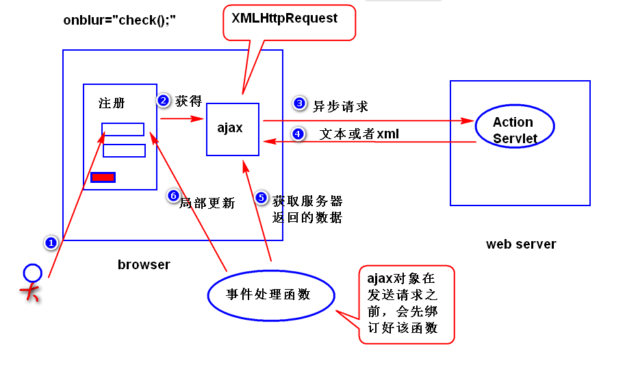
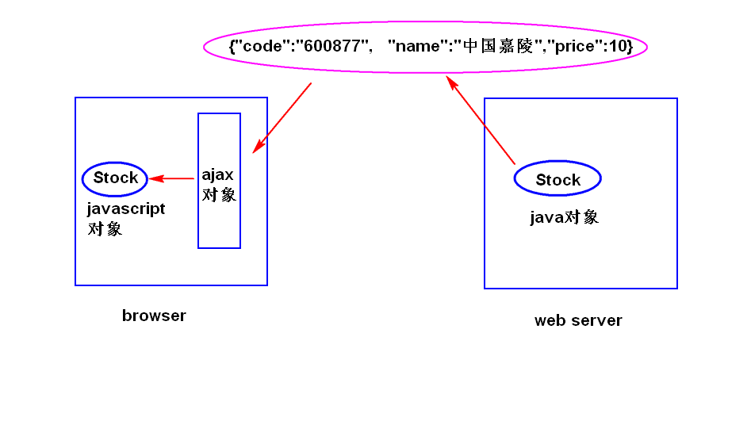

# ajax-day01

## 1. ajax　（asynchronous javascript and xml） 异步的js和xml
### (1)什么是ajax?
	是一种用来改善用户体验的技术，其本质是利用浏览器提供的一个
	特殊对象（XMLHttpRequest对象，或者简称为ajax对象）向服务器
	发送异步请求，服务器返回部分数据，浏览器利用这些数据对当前页
	面做局部更新。整个过程，页面无刷新，不打断用户的操作。
	注：
		异步请求，指的是当ajax对象发送请求时，浏览器不会销毁当前
	页面，用户仍然可以对当前页面做其它操作。

### (2)如何获得ajax对象?
	因为历史原因，需要区分浏览器。
	function getAjax(){
		var xhr = null;
		if(window.XMLHttpRequest){
			//非ie浏览器
			xhr = new XMLHttpRequest();
		}else{
			//ie浏览器
			xhr = new ActiveXObject('MicroSoft.XMLHttp');
		}
		return xhr;
	}

### (3)ajax对象有哪些重要的属性?
	1)onreadystatechange: 绑订一个事件处理函数。
		注：
			readystatechange事件：当ajax对象的readyState
			属性值发生了任何的改变（比如从０变成了１）,就会
			产生该事件。
	2)readyState:有五个值(0,1,2,3,4),用来获得ajax对象与服务器
			通信的进展状况。其中，4表示ajax对象已经获得了服务
			器返回的所有数据。
	3)responseText:获得服务器返回的文本数据。
	4)responseXML:获得服务器返回的xml数据。
	5)status:获得服务器返回的状态码。

### (4)编程步骤
	step1. 获得ajax对象
	比如:
			var xhr = getAjax();
	step2.利用ajax对象发送请求
	方式一　发送get请求：   http协议　get post
		xhr.open(请求类型，请求地址，同步还是异步);
	比如:
		xhr.open('get','check.do?uname=Sally',true);
		xhr.onreadystatechange = f1;
		xhr.send(null);
		注：
			true表示异步，false表示同步(当ajax对象发送请求时，
		浏览器会锁定当前页面，用户不能对当前页面做其它操作)。
		建议尽量少用同步。
	
	方式二
		xhr.open('post','check.do',true);
		xhr.setRequestHeader('content-type',
		'application/x-www-form-urlencoded');
		xhr.onreadystatechange = f1;
		xhr.send('uname=Sally');
		注:(了解)
			按照http协议要求，post请求应该在请求数据包里面
			添加content-type消息头。ajax对象默认不会添加该
			消息头，所以，需要调用setRequestHeader方法来添加。

	step3.编写服务器端的程序
		注：服务器端通常只需要返回部分数据。
	step4.编写事件处理函数
		if(xhr.readyState == 4 &&
			xhr.status == 200){
			var txt = xhr.responseText;
			更新页面...
		}
				
### (5)缓存问题
	1)什么是缓存问题?
		ie浏览器提供的ajax对象在发送get请求时，会比较请求地址
	是否访问过，如果访问过，则不再发送新的请求，而是显示第一次
	返回的结果。	
	2)如何解决?
		在请求地址后面添加一个随机数。

### (6)编码问题
	1)发送get请求
		a.为什么会有乱码?
			ie浏览器会使用gbk来编码，其它浏览器会使用utf-8
			来编码，服务器端默认会使用iso-8859-1来解码，所以
			会有乱码。
		b.解决方式
			step1. 服务器端，统一使用utf-8来解码
				URIEncoding="utf-8"
				注意：只针对get请求有效。
			step2. 客户端，使用encodeURI函数对中文进行编码。
				注意:  encodeURI函数是javascript内置的函数，
					会使用utf-8对中文进行编码。
	2)发送post请求
		a.为什么会有乱码?
			浏览器会使用utf-8来编码，而服务器端会使用iso-8859-1
			来解码。所以会产生乱码。
		b.解决方式?
			request.setCharacterEncoding("utf-8");

# ajax-day02

## 1. JSON (javascript object notation) 声明
### (1)什么是JSON?    
	是一种轻量级的数据交换格式。
	1)数据交换
		将要交换的数据先转换成一种与平台无关的数据格式（比如xml）,
	然后发送给接收方来处理。
	2)轻量级
		JSON相对于xml,文档更小，解析速度更快。
### (2)语法
	1)表示一个对象
	{属性名:属性值,属性名:属性值...}	
	比如:
			{"name":"Sally","age":22}
	注意：
		a.属性名必须使用双引号括起来。
		b.属性值可以是string,number,true/false,null,object。
		c.属性值如果是string,必须使用双引号括起来。
	2)表示对象组成的数组
	 [{},{},{}...]
	
### (3)使用JSON?
	1)java对象转换成json字符串
		可以使用　jackson api　（ObjectMapper）
	2)json字符串转换成javascript对象
		可以使用 javascript内置对象JSON提供的parse方法。

## 2. jQuery对ajax编程的支持
### (1)$.ajax方法
	1)用法
		$.ajax({});
	{}是一个对象，用来控制ajax对象如何向服务器发送请求，常用
	的选项参数有如下几个:
		url   指定请求地址　(比如 "quoto.do")
		type  指定请求类型　(比如 "get")
		data  指定请求参数，有两种格式
				第一种　请求字符串形式　（比如 "name=Sally&age=22）
				第二种　对象形式（比如 {"name":"Sally","age":22}）
		dataType 指定服务器返回的数据类型，有如下几种:
				json  	json字符串
				text  	文本
				html  	html文档
				xml   	xml文档
				script  javascript脚本
		success  指定一个函数，用来处理服务器返回的数据。
				注：服务器处理正常，并且ajax对象已经获得了
				服务器返回的所有的数据。
		error    指定一个函数，用来处理服务器返回的数据。
				注：服务器发生异常。
		async   同步还是异步(true表示异步)。

### (2)load方法
	1)作用：向服务器发送异步请求，并且将服务器返回的数据直接添加到
		符合要求的节点之上。
	2)用法:
			$obj.load(url,[data]);
		注:
			$obj  要操作的节点，是一个jQuery对象。
			url  请求地址。
			data (可选) 指定请求参数，有两种格式(同上)。

### (3)一个实用方法
	serialize(): 表单异步提交时，生成一个由各个表单域组成的
		一个请求字符串。

	
		
	
		
	

				
