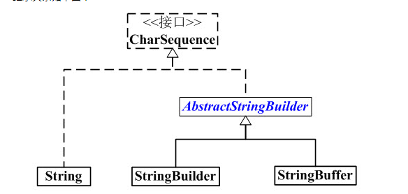
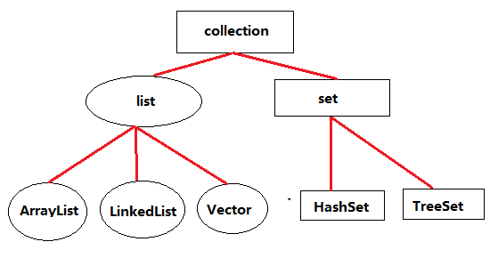
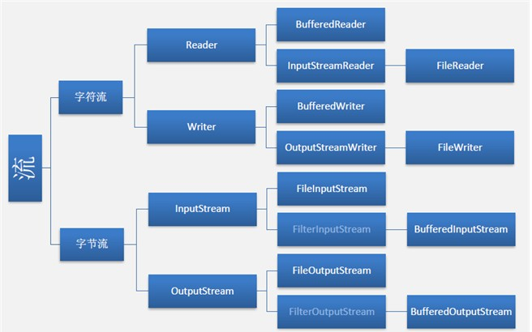

#  API-day01
##1.注释：  ##

	1)	//		单行注释
	2)	/* */	多行注释
	3)	/** */ 	文档注释
		3.1)文档注释只写在类上,方法上和常量上
		3.2)文档注释最终可以被javadoc命令解析并生成为一个文档手册.
		@author adminitartor  :作者
		@version 1.0		  :项目版本	
		@see java.lang.String :参考的类.包
		@since JDK1.0		  :jdk版本
		--------------------------
		@param name  指定的用户名
	    @return 带有问候语的字符串
		
##2.String 类
	1) String 类是final修饰的, 不可被继承
	2)字符串是不变对象,即:字符串对象创建后内容不可变改变内容会创建新对象
	3)字符串通常使用字面量形式创建,因为字面量形式创建的字符串对象会缓存在常量池中被重用,减少
	大量内容一样的字符串对象对内存的不必要开销
	4)编译器在编译源程序时若发现一个计算表达式的所有内容都是直接量,那么会直接计算该表
	达式并将结果编译到class文件中.

###2.1)int length() ------返回当前字符串的长度
	1)  字符串下标从0开始
		int len = str.length();
		System.out.println("len:"+len);
		
###2.2)int indexOf(String str) --返回给定字符串在当前字符串中的位置,
	1)若当前字符串不含有给定字符串则返回-1
	2)index = str.indexOf("in", 3)   ------从指定位置开始查找
	3)index = str.lastIndexOf("in"); ------查看最后一次出现的位置
	
###2.3)char charAt(int index)------返回当前字符串中指定位置的字符
	##案例:查看字符串是否为回文
		
###2.4).String substring(int start,int end)------截取当前字符串指定范围内的字符串并返回.
	1)在java api中通常使用两个数字表示范围时,都是"含头不含尾"的.
	2)String sub = str.substring(4);-------如果传一个参数则从指定位置截取到最后
	
###2.5)boolean startsWith(String str)------判断字符串是否是以给定字符串开始
  
	1)boolean endsWith(String str)------判断字符串是否是以给定字符串结尾的 
  
###2.6)String trim()------ 去除当前字符串两边的空白字符

###2.7)String toUpperCase()------ 将当前字符串中的英文部分转换为全大写

	1)String toLowerCase()------ 将当前字符串中的英文部分转换为全小写
  
###2.8)static String valueOf(...)------将java其他类型转换为字符串

	1)String提供了一组重载的静态方法valueOf,作用是将java其他类型转换为字符串
	 常用于将基本类型转换为字符串
	2)调用时,使用类名点调用.
	3)有另两种方法: .toString;     和  +"";

##3.java.lang.StringBuilder

* StringBuilder:单线程, 效率高, 不安全

* StringBuffer:多线程, 效率低, 安全
	
* 1)StringBuilder是为了解决频繁修改字符串对系统资源开销问题.

* 2)StringBuilder内部是一个可变的字符数组,可以通过扩容来实现长度变换,而不是每次创建新对象.

* 3)StringBuilder提供了方便修改字符串内容的方法.

###3.1)创建对象: StringBuffer builder= new StringBuffer("努力学习java");

###3.2)append(String str);------append()方法用于将给定内容拼接到当前字符串末尾.

###3.3)replace(9, 16, "...");------replace()将当前字符串中指定范围内的内容替换为给定内容

###3.4)delete(0, 8);------delete():删除指定范围内的内容

###3.5)insert(0, "活着");------insert():在当前字符串指定位置插入指定字符串内容

###3.6)reverse();------翻转字符串

		
#API-day02

## 1.正则

* 1). 正则本身也是字符串
* 2). 用于匹配字符串中字符次序的"规则字符串"
* 3). 很多编程语言,包括Java都支持了正则表达式

* 正则表达式(Java String API 方法) 将一个字符串与正则表达式进行匹配,如果匹配成功就返回true,否则返回false
 

###1) boolean matches(String regex)--- 用于测试字符串整体是否符合正则规则：
* 括号内放入正则表达式
* 符合返回true;
* 不符合返回false;
###2)字符集合
		[abc] a b c 中任意 字符
		[^abc] 除了a\b\c\的任意字符
		[a-z]	a-z  中的任意字符
		[a-zA-Z0-9] a-z A-Z 0-9中任意字符
		[a-z&&[^bc]]a-z 中除了bc以外的任意一个字符  &&表示与的关系
###3)预定义字符集
		.	--- 任意一个字符
		\d	---	任意一个数字字符,相当于[0-9]
		\w	--- 相当于[a-z A-Z 0-9  _ ]
		\s	--- 空白字符 相当于 [\t\n\x0B\f\r]
		\D 	--- 非数字字符
		\W	--- 非单词字符
		\S	--- 非空白字符
###4)数量词
		X? 表示0个或任意1个X
		X* 表示0个或任意多个X
		X+	表示1个到任意多个X
		X{n} 表示n个X
		X{n,} 表示n个到任意多个X
		X{n,m}	表示n个到m个X
###5)分组
		( | )
		分组(序列1|序列2|序列3)    =====序列1 序列2 序列3 多选一

* 案例:匹配一个图片文件
 
				\w+\.(jpg|png|gif|jpeg|bmp)

* 案例:匹配手机号
 
			15131997996
			+8618605323252
			+86 18603252251
			00186 18603251521a
			10086 15245213510
			String reg ="(\\+86|0086)?\\s?1\\d{10}\b";
		 
###6)边界匹配
		^--代表字符串开始 
		&--代表字符串结束

* matchs 方法进行整体匹配检查,相当于包含^$边界检查, 造成如上正则检查 结果相同!这个不是正则表达式的问题  //是java matchs 方法的现象
 
###7)String[] split(String regex)----切割字符串

* 该方法可以将字符串按照特定的分隔符拆分成字符串数组将字符串按照匹配到的位置切开,切除匹配到的字符,将切开的结果保存到字符串数组

		语句:String[] a= ***.split(String regex)   --regex 表示指定的分隔符(正则表达式)

### 8)String replaceAll();-------  将字符串中匹配正则表达式 regex 的字符串替换成replacement
	   语句:String replaceAll(String regex, String replacement) 
	   		用法:
		  		新字符串=源字符串.replace(正规,"替换")
				正则用于匹配替换目标,"替换"是替换所有的字符串
### 9)转义:
		正则匹配特殊字符时候，需要利用\进行转义
		 如:匹配字符[  采用： \[
		     特殊字符包括:[]  \ | () . * + ?等 

			 
##2.Object类

* Java 中任何类型都继承于Object, 是Ojbect 的子类型(String 也继承了Object类)
	
* Object可以定义变量,引用任何类型(子类型)的对象 
	
* Object 中定义了全体类共同的方法,子类会自动的继承这些方法
		
### 1)String

	
	

* 1.1)toString() 方法就是在Object类上定义的方法, 是留给全部子类的方法!

			Java 提供的API几乎都重写了 toString()
			包括: String StringBuilder Date Integer...
	

* 1.2)默认的toString方法返回值没有意义!
* 
		 返回的是 类名@散列值
		  

* 1.3)建议在子类中重写toString方法.一般返回子类的重要数据
 
			//重写toString方法
			public String toString(){
			//返回Point对象的关键数据
				return x+","+y;
			}
		

* 1.4)调用重写的方法,会自动调用子类重写的方法
 
			//调用toString 方法
			Point p = new Point(5,6);
			String s = p.toString();	//输出的是字符串 已转换为字符串

* 1.5)toString方法的用途:Java和API会自动调用toString方法,利用这个特点可以简化程序的调试输出.

			 如:println(p)会自动调用toString

* 1.6)String 也重写了 equals 方法用于比较两个字符串对象是否相等
 
### 2) equals 
	

* Object 提供了比较两个对象是否相等的方法equals
		

* 2.1)默认的equals方法不能比较对象中数据是否相等,  建议子类重写这个方法!

* 2.2)重写时,按照关键数据比较两个对象是否相等
 
			如下两个对象,不同的对象,但是关键数据是相同的.
			是数据相等 的对象
			利用没有重写的equals 比较
				Point p1 = new Point(3,4);
				Point p2 = new Point(3,4);
				boolean b = p1.equals(p2);
				System.out.println(b);   //false 
		 
			利用重写的equals方法比较两个对象相等
				Cell c1 = new Cell(3,4);	
				Cell c2 = new Cell(3,4);
				Cell c3 = new Cell(5,4);
				System.out.println(c1.equals(c2));   //true
				System.out.println(c1.equals(c3));	//false 
			

* 2.3)重写equals
* 
		public boolean equals(Object obj){
			if(obj==null){
				return false;	
			}

			//方法执行期间 this 是当前对象
			//obj是另外一个对象的引用
			//比较关键数据:就是比较this(row,col)
			//和obj(row,col)是否相等 
			if(this==obj){
				return true; //性能好
			}

			if(obj instanceof Cell){
				Cell other = (Cell)obj;
				return this.row == other.row
						&&
						this.col == other.col;
				}

			return false;
		}

##3.包装类  

* 	用于将基本类型包装为对象

* 	包装类是final 修饰的 不可变类 在构造了包装类对象后,不允许 更改包装在其中的值;

* Number  是 Integer Character 等 六种基本类型的父类型 
 
	 		Object 是 char 和 boolean 的父类型

* Number 定义的子类型的公用方法, 全部子类型都继承了这些方法.

* Number 定义的方法包括:6种数值类型相互转换的方法

* Java 5 开始提供了自动装包和自动拆包,目的是简化编程, 简化程序员的负担,编程期间将代码替换为对应的包装类方法
	  
### 3.1)创建对象: 

	Number n = new Integer(5);
	Double x = new Double(4.5);

### 3.2)int intValue();	---- 包装类-->基本类型(拆包)

* API 提供了将基本类型转换为包装类型的方法, 也提供了将包装类型转换为基本类型的方法
	

	例:
	Number n = new Integer(5);
	
		//doubleValue()是类型转换方法
	double d = n.doubleValue(); //拆包

	System.out.println(d); //5.0

### 3.3)Integer.valueOf(传入基本类型);  ----基本类型-->包装类型(装包)
		
	例:
	int i = 3;

	Double d = Double.valueOf(i);
	System.out.println(d);  //3.0

### 3.4)int Integer.parseInt(10进制字符串)--------字符串-->为基本类型

* 包装类提供了 "10进制String" 到 基本类型(2进制)的转换方法,这些方法是是Java最核心方法:
  "Java 能够认识10进制全靠这些方法了!!"

		double Integer.parseDouble(10进制字符串)-----将字符串转换为数值

		例:
		int n = Integer.parseInt("-9");
		double pi = Double.parseDouble("3.1415926535897932384626");

### 3.5)String String.valueOf(传入基本类型)---------基本类型-->字符串

		
		int i = 3;

		String str = String.valueOf(i);
		System.out.println(str);  // 字符串"3"

			
	
### 3.6)double Double.MAX_VALUE-------求最大值;

### 3.7)int Integer.MIN_VALUE;--------求最小值;
		

	
		
	
		
	
		
	
	
		
	

#API-day03

##1.Date类
	

* java .util.Date

* Date 的每一个实例用于表示一个确切的时间点

* 由于Date设计存在缺陷,所以在JDK1.1以后大部分方法就被声明为过时的,不再建议使用现在使用Date仅用来表示时间.时间相关的操作全部使用 Celender 来代替

### 1.1)创建对象: Date date = new Date();

* 在括号中传入一个毫秒值 则表示毫秒值代表的时间

* 默认创建出来表示当前系统时间 Date重写了toString方法,输出的是当前Date表示的日期时间.
 
	 		Date date = new Date();	
			System.out.println(date);
																					
###1.2)long getTime()---获取Date内部维护的long值 (毫秒值)1970-1-1至此时此刻的

		Date date = new Date();
		
		long l = date.getTime();
		System.out.println(l);
			
###1.3)void setTime(Long time); ---为Date设置一个long值,使其表示该long值所表示的时间

		Date date = new Date();

		l += 1000*60*60*24; //加上一天的毫秒数

		date.setTime(l);
		System.out.println(date);

	  
##2 java.text.SimpleDateFormat

		

* 可以按照一个给定的日期格式在Date与String之间相互转换.
 
### 2.1)创建对象:
	SimpleDateFormat sdf = new SimpleDateFormat("yy年MM月dd日 hh:mm:ss a E");
		

###2.2)String sdf.format(Date date)------  Date --> 字符串

		Date date = new Date();
		SimpleDateFormat sdf = new SimpleDateFormat("yyyy-MM-dd hh:mm:ss a E");
		String ss = sdf.format(date);
		System.out.println(ss);

###2.3)Date parse(String source)--------字符串 --> Date

* 按照SDF指定的日期格式将给定字符串解析为Date对象

		Date date = new Date();
		SimpleDateFormat sdf = new SimpleDateFormat("yyyy-MM-dd hh:mm:ss")
		String dd = "2008-08-08 12:30:59";

		date = sdf.parse(dd);
		System.out.println(date);

##3.java.util.Calendar 日历类

* 日历类,定义了操作时间的相关方法.
 
* Date大部分方法声明为过时的而代替方案就是使用Calendar

* Calendar 本身是抽象类,规定了操作时间的方法定义,

* 常用实现类GregorianCalendar, 即:阳历立法

* Calendar提供了一个静态方法getInstance()来根据当前系统所在地区返回一个适用的实现类,大部分地区返回的都是阳历实现类.

### 3.1)创建对象:Canlendar calendar = Calendar.getInstance();

* 创建了一个对象,返回一个适用的实现类GregorianCalendar,同下:
 
		Calendar calendar = new GregorianCalendar(); 
		
		
### 3.2)Date getTime()------获取一个Date对象

* Calendar提供的该方法可以获取一个Date对象,该对象就表示当前Calendar所表示的日期

		Calendar calendar = Calendar.getInstance();
	
		Date date = calendar.getTime();
		System.out.println(date);
	

		
###3.3)void setTime(Date date)----设置给定的Date所表示的日期
 
* 使当前Calendar表示给定的Date所表示的日期
 
		Calendar calendar = Calendar.getInstance();
		Date date = new Date();

		calendar.setTime(date);

		
###3.4)void add(int field, int value)----对指定时间分量加定值
* 	对指定时间分量加定值.若传入的值为负数,则减去给定的值
		
		Calendar calendar = Calendar.getInstance();

		//对年中的日加3天
		calendar.add(Calendar.DAY_OF_YEAR, 3);
		
		
###3.5)void set(int field, int value)---设置给定时间分量值

* 		设置为给定的时间分量值

* 		月从0开始算

* 		每周第一天从周日开始

		Calendar calendar = Calendar.getInstance();

		//设置为当周的第2天
		calendar.set(Calendar.DAY_OF_WEEK, 2);

	
###3.6)int get(int field)----获取指定时间分量对应的值

* 该方法可以获取当前Calendar中指定时间分量所对应的值. (如获取今年的值)

* 时间分量是一个int值,在Calendar中有大量的常量定义了不同的时间分量
	
	
		Calendar calendar = Calendar.getInstance();
		
		//获取今年是哪一年?
		int in = calendar.get(Calendar.YEAR);
		System.out.println(in);

	
##4)Collection  --集合类

* java.util.Collection是一个接口 

* 集合,用来存储一组元素,提供了相关操作元素的方法.

* 集合存放的是元素的引用(地址)

* 有两个常见的子接口:
	
		List :可重复集,且有序;
		Set: 不可重复集,大部分实现类是无序的.
	
		元素是否重复是依靠元素自身equals方法比较的结果	
						 	
* Collection 中的方法在 ArrayList LinkedList HashSet ( )都可以用

* 数组和集合(线性表)区别: 
  
		数组:只能存储数据
		集合:存数据还提供算法  底层就是利用的数组
 	
###4.1)创建对象:

			接口				实现类
			 |				  |
		Collection c = new LinkedList();
	
		Collection c = new ArrayList();

		

### 4.2)boolean add(E e)---------添加元素

* 向集合中添加指定元素,成功添加返回true

		Collection collection = new ArrayList();
		boolean b = collection.add("e");

### 4.3)boolean addAll(Collection c)---------将给定集合中的全部元素添加到当前元素
* 添加成功返回true, 否则返回false

		Collection c1 = new ArrayList();
		Collection c2 = new ArrayList();
		
		//将c2集合中的所有元素添加到c1集合中
		boolean b = c1.addAll(c2);

### 4.4)boolean isEmpty();--------  判断集合是否为空巢

* 判断集合是否为空巢(不含有任何元素)

* 如果为空 返回true 否则返回false

		Collection collection = new ArrayList();

		boolean b = collection.isEmpty();

			
###4.5)int size();--------------返回当前集合的元素个数

		Collection collection = new ArrayList();

		int n = collection.size();

		
###4.6)void clear();--------清空集合

		Collection collection = new ArrayList();

		collection.clear();

###4.6)boolean contains (E e)------判断当前集合是否包含给定元素

* 括号中一般放object 程序前提是元素必须有equals比较方法
 
		Collection collection = new ArrayList();

		boolean b = collection.contains(obj);

###4.7)boolean containsAll (Collection c)------判断当前集合是否包含给定集合中元素
* 如果包含返回true; 否则返回false;
		Collection c1 = new ArrayList();
		Collection c2 = new ArrayList();
		
		boolean b = c1.contains(c2);

	
###4.8)boolean remove(Object obj);---------移除集合内给定元素

* 移除成功返回true; 否则返回false
		
		Collection collection = new ArrayList();
			
		boolean b = collection.remove(obj);
	

# API-day04

## 1.Iterator 迭代器 ##

### 1.1)创建对象: ###
* 该对象,用于遍历集合,对 collection 进行迭代

			Collection collection = new ArrayList();
				
			Iterator ite = collection.iterator();

### 1.2)boolean hasNext();--------检查是否有下一个引用 ###
* 如有下个元素则返回true, 否则返回false;

### 1.3)E next() ------移动游标到下个位置,返回迭代的下一个元素。###
*使用Object类型接收

### 1.4)void remove()-----移除集合中的元素 ###	

### 1.5)迭代器遍历集合 ###	
* hasNext  和 next 在循环体中只能调一次
* 遍历期间可以使用 remove() 方法移除元素
 
		Collection c1 = new ArrayList();
		Iterator ite = c1.iterator();
	
		while(ite.hasNext()){		//检查是否有下一个引用 ,直到下个元素为空
			String str = (String)ite.next();	//移动游标到下个位置,返回引用集合中的元素给str
			System.out.println(str);
			ite.remove(); //移除元素
			//c1.remove();//如果使用集合的方法删除元素会报拋出异常错误
		}

		(迭代器遍历集合时，不要通过集合的方法修改和删除元素否则抛出异常)
		迭集器和集合之间,没有互斥关系,如果一个线程正在遍历 一个线程删除,则会报错
	
### 1.6)foreach:(增强for) ###	
* foreach 循环不能遍历(迭代)期间删除集合中的元素!! 如果需要删除请使用传统的迭代器实现!
* 如果集合泛型了,使用泛型的类型接收
* 没有泛型,使用Object类型接收
* 
		Collection c1 = new ArrayList();

		for(String str : c1){     // “：” 前声明接收类型，“：”后放集合或数组 
			System.out.println(str);
		}
	
	
	
### 1.7)泛型:对集合泛型
	

	Collection<String> c1 = new ArrayList<String>();
		<String > 泛型<约束类型>

* <String> 约束了c1集合中只能存储String类型的数据,如果放入其他数据,将出现编译错误

## 2) List(类)

* 实现类 ArrayList 数组实现 读得多 改得少,建议使用
* 实现类 LinkedList 链表实现 增删性能好,建议使用
	

### 2.1)创建对象: ###

	List<String> list = new ArrayList<String>();

	List<String> list = new LinkedList<String>();

### 2.2)E get(int index);----------返回列表中指定位置的元素。
* 便用Object 或 泛型的类型接收

### 2.3)E set(int index, E e) 用指定元素替换列表中指定位置的元素###

		List<String> list = new ArrayList<String>();

				替换的位置  替换的内容
					|		   |
		list.set(    3,      "mac"   ) 替换 有返回值

* get()方法和 set()方法结合使用 可以在列表内进行两个元素的位置替换
 
	list.set(3,list.set(2,list.get(3))) //列表内元素替换 有返回值

### 2.4)void add(int index, E element);------集合内指定位置添加给定元素###

	list.add(2,"ee")

### 2.5)E remove(int index);--------//删除有返回值 即删除的元素
	
	
### 2.6)List<E\> subList(int fromIndex, int toIndex);------获取列表的子列表
* 子列表:子列表与主列表共享同一个存储空间  如果删除子列表,主列表中也被删除
* 子列表:位置含头不含尾
 
		List<String> list = new ArrayList<String>();
		
		//获取子列表
		List<String> sub = list.subList(1, 1+4);      
	

### 2.7) T[ ] toArray(T[ ] ary)----------List转换为数组

* 		1,如果参数数组长度比集合长度小了, 则必须接收返回值,返回值是新数组的引用  (需创建数组接收)
* 		2,如果参数数组长度正好,则返回值是参数数组本身 可以不必接收返回值
* 		3,如果参数数组长度大了,返回值也是参数数组本身,可以不必接收返回值
	
	
* 目的:为了做了些性能比较高的算法需要将集合复制到数组中
 
		List<String> list = new ArrayList<String>();

		String[] ary = new String[4];  //参数数组
		
		//如果参数数组长度大于或等于 集合长度 则不必接收
		list.toArray(ary);  

		//如果参数数组长度小于集合长度,则需要接收
		String[] arr = list.toArray(ary);

		补充: Arrays.fill(ary,"A");  >> 将数组中每个元素赋值为A
	
			Arrays.toString(ary);>>将数组中的元素转换为String类型输出
	
	
### 2.8)Arrays.asList(ary);-------数组转换为List
* 创建一个list集合接收
* 用法:List <String\> list = Arrays.asList(ary);

* 目的:将数组作为线性表使用:
 
	1.与数组共享存储空间

	2.不是完整功能的List ,不能改变长度

* 修改数组内容 会影响List, 修改List 会影响数组  集合长度不能改变

		例:

		String[] ary = {"123","234","dfs"};
	
		List<String> list = Arrays.asList(ary);

### 2.9)List排序

* 一般JAVA提供的API都实现了 Comparble  接口中的 CompareTo 进行排序的方法, String Date Integer包装类 都可以实现排序,自己创建的类是不能使用CompareTo进行排序的 如果使用则需要实现Comparble接口, 然后重写CompareTo,但是不建议重写CompareTo方法, 可以自定义比较器 实现重载

* 用法1:

 	 自然排序:Collections.sort(list) 对List集合中的元素进行排序

	* 要求:list集合中的元素必须实现Comparable接口,必须实现compareTo方法 ,一般用于java对提供的API对象进行排序  如: String Date, Integer, Double 等 包装类
	
	* compareTo
	 
	* sort  方法是如何比较两个字符串大小的?

		 1)内部 是按照unicode码进行排序的
	
		 2)String类型提供比较字符串大小的方法

		 3)compare比较 to 比xxx比较

		 4)compareTo 返回3种状态: >0 <0 ==0
		  
		 4.1)n > 0 表示 第一个字符串大

		 4.2)n < 0 表示 第一个字符串小

		 4.3)n = 0 表示 两个字符串一样!!
		 
		 4.4)int n = "Andy".compareTo("Jerry");  //返回值类型是int型   

			例:

			public class Emp implements Comparable<Emp> {}

				public int compareTo(Emp e) {
					return e.age-this.age;
		 		}

* 用法2:

 	自定义排序 Collections.sort(list. 比较器);

	* 即 自定义比较器,实现重载sort方法

	* 重载的sort方法可以实现任意对象的自定义排序!

	* 要求:对list集合中的对象没有限制,必须提供"比较器"对象,sort会利用比较器进行比较排序

	* 用途广泛:可以进行任意数据比较排序	
				
		1)实现自定义比较器 创建一个类实现 实现一个接口 Comparator

			class ByAge implements Comparator<Cat>{}   Cat :自己创建的类

			自定义的比较算法:按照猫对象的年龄比较大小

			如果返回>0 则 o1> o2

			如果返回<0 则 o1<o2

			如果返回=0 则 o1=o2;
			 
		2)重写compare方法

			public int compare(Cat o1, Cat o2){
   
				int a1 = o1.age;

				int a2 = o2.age;

				//return a1-a2;//经典写法  如果大到小排序  return  -(a1-a2);

				if(a1 > a2){
					return 1;
				}else if(a1<a2){
					return -1;
				}
				return 0;
			}

		3)调用排序

			Collections.sort(list,new ByAge());
		
	
		4)方法只使用一次,可以用匿名内部类
			
			Comparator<E>  com = new Comparator<E>(){
				
				 public int compare(E e1, E e2) {
					return e2.age-e1.age;
				}
			}

			调用时：Collections.sort(list,com);
	

		

#API day05
##1.队列  
	

- java.util.Queue
	

- 队列, 继承自集合 Collection 

* LinkedList实现了Queue接口

- 可以存储一组元素,但是存取元素必须遵循"先进先出"原则

- 只能从线性表的一端添加,从另一端取出

- 队列 实现了List接口 同时实现了Queue接口

### 创建队象:Queue<String\> queue = new LinkedList<String\>();

###1).offer(E e) 添加元素 
###2)E poll();-----出队操作
	2.1)从队首获取元素,获取后该元素就从队列中被移除.
###3)E peek();-----引用队首元素
	3.1)引用队首元素,获取队首元素后该元素还在队列中
	
###4)迭代器遍历(遍历完成,元素还在队列中)
	for(String e:queue){
		System.out.println(e);
	}
###5)自行遍历(遍历完成,元素被取出)
	while(queue.size()>0){
		String str = queue.poll();
		System.out.println(str);
	}
	实际用法:服务器排队

##2.双端队列

- 双端队列接口继承自队列接口(Queue)  -Queue -Deque -LinkedList

- 两端都可以进出队的队列,

###创建对象:Deque<String\> deque = new LinkedList<String\>();
	
###1)offerFirst(E e);-----从队首添加元素
###2)offerLast(E e);-----从队尾添加元素 ####
###3)E pollFirst();-----从队首取出元素 ####
###4)E pollLast();-----从队尾取出元素 ####
###5)E peekFirst();-----引用队首元素 ,元素不被取出####
###6)E peekLast();-----引用队尾元素 ,元素不被取出####
###7)迭代器遍历(遍历完成,元素还在队列中)
	for(String e:deque){
		System.out.println(e);
	}
###8)自行遍历(遍历完成,元素被取出)
	while(deque.size()>0){
		String str = deque.pollFirst();
		System.out.println(str);
	}

##3.栈	
- 栈结构:

	
	栈用来存储一组元素,但是存取元素必须遵循先进后出原则(FILO,First Input, Last Output)

	栈结构常被用来实现"后退"功能

	Deque是双端队列,但是若只从一端进出队就实现了栈结构

### 创建对象:Deque<String\> stack = new LinkedList<String\>(); ####

### 1)push(E e) -----进栈 ####

### 2)E pop();-----弹栈 ####
		2.1)有返回值,返回值为弹出的元素

### 3)迭代器遍历 (遍历完成后,元素还在)####
		for(String s:stack){
			System.out.println(s);
		}

### 4)自行遍历(遍历完成后,元素被弹出) ####
		while(stack.size()>0){
			str = stack.pop();
			System.out.println(str);
		}

##4.Map 查找表
- java.util.Map
- 查找表,以key-value 对的形式存储元素.  (键-值)
- 常用实现类:java.util.HashMap
- HashMap:散列表,以散列算法实现的Map
- Map要求key不允许重复,是否重复取决于key元素equals方法比较的结果
- 泛型 要指定两个类型个 键K, 值V
### 创建对象:Map<String, Integer> map = new HashMap<String, Integer>(); ####

### 1) V put(K k, V v)-----将对应的键值存入到Map中 ####
		1.1)由于Map 要求key不允许重复,所以若使用已有的key存入新的value则是替换key原来对应的
		value值,并将其返回(返回值为替换掉的V值).若指定的key在Map中不存在,则返回值为null.
		1.2)尽量不使用基本类型去接收返回值,因为若返回值为null,触发自动拆箱时会引起空指针异常

### 2) V get(K k)-----获取指定key所对应的value ####

		2.1)若指定的key在map中不存在则返回null
### 3)V remove(K k)----- 将给定的key对应的键值对从map中删除####
		3.1)返回值为该key对应的value
	
### 4)int size();-----获取元素长度 ####

### 5) boolean containsKey(K k);------判断当前map是否包含给定的key####

		5.1)判断标准还是参考元素equals比较的结果
### 6)boolean containsValue(V v);------判断当前map是否包含给定的value ####
		6.1)判断标准还是参考元素equals比较的结果
	

### 7)Set keySet()-----获取所有K值 (遍历所有的Key) ####

		7.1)该方法会将当前Map中所有的key存入一个Set集合后返回
			Set<String> keySet = map.keySet();
			for(String key: keySet){
				System.out.println("key:"+key);
			}

### 8)Set entrySet()  ----- 获取每一组键值对(遍历所有键值对) ####
- 返回值为Set集合
- K getKey()------获取该键值对的key值
- V getValue()------获取该键值对的value值
 
		8.1)Entry是Map的内部类,其每一个实例用于表示Map中一组键值对
		8.2)常用方法:getKey,getValue. 这两个方法分别用于获取该组键值对中的key与value
		8.3)entrySet方法会将当前map中每一组键值对以一个Entry实例的形式存入Set集合后将该Set集合返回.

		//遍历每一组键值对
		Set<Entry<String,Integer>> entrySet = map.entrySet();
			for(Entry<String,Integer> e : entrySet){
				String key = e.getKey();
				Integer value = e.getValue();
				System.out.println(key+":"+value);
		}

### 9)Collection values()-----将Map内所有的value存入一个集合
		9.1)遍历所有的value.
		Collection<Integer> values = map.values();
			for(Integer i :values){
				System.out.println(i);
			}

### 10)HashMap  查询性能
			影响散列表(HashMap)查询性能的一个主要原因是在HashMap中产生链表产生链表的主要情况有两种: 		
			1:元素多,概率问题(通过加载因子解决,也要避免护容rehash,可以给定一个长度)
		 	2:作为Key元素 equals方法与hashcode方法的重写不当.

			当两个key的hashcode值相同时,它们在HashMap内部数组(散列桶)中的位置就相同,若这两个key的equals
		方法比较为false时就会产生链表.	

		 	当一个类在重写equals方法时就应当连同重写hashCode方法.并且遵循以下原则:
				稳定性:在一个对象参与equals比较的属性值没有发生改变的前提下,多次调用hasoCode值返回的数字必须相同. 不能是随机数
			    一致性:当两个对象equals比较为true时,hashcode值要相等 

	 		反过来若两个对象hashcode值相等 equals方法也应当为true,若不然则可能会在	HashCode中出现链表
			影响查找性能.

#API-day06
##1.File类
	
	

-  java.io.File
-  File的每一个实例用于表示文件系统中的一个文件或目录
-  使用File可以:
	- 1:访问文件或目录的属性信息(名字,大小,修改时间等 )
	- 2:操作文件或目录(创建,删除)
	- 3:访问目录子项
- 但是不能访问文件数据

###创建对象:File file = new File("."+File.separator+"Demo.txt");
		File file = new File("test.txt");
		当前目录下创建一个名为test.txt的文件 
		 * ".\" 不写默认也是在当前目录下
		 * \: 用File.separator 代替
- 在使用路径时尽量使用相对路径,因为绝对路径不同的系统是不一样的,这就导致跨平台会有问	题.
- 相对路径常用:
	- 1:类加载路径(最常用)
	- 2:当前目录, 在eclipse中当前目录就是指当前类所在的项目目录
###1)String getName();------获取文件名字
###2)long length();-------获取文件字节量 ####
###3)boolean canRead();----------查看文件是否可读 ####
###4)boolean canWrite();--------查看文件是否可写 ####
###5)boolean isHidden();--------查看文件是否隐藏 ####
###6)long lastModified();--------查看文件最后修改时间 ####
	long time = file.lastModified();
	SimpleDateFormat sdf = new SimpleDateFormat("yyyy-MM-dd HH:mm:ss");
	System.out.println("最后修改时间:"+sdf.format(time));
### 7)boolean exists()--------判断当前File 表示的文件或目录是否真实存在####
### 8)boolean createNewFile() ------创建文件,成功返回true####
	if(!file.exists()){
		file.createNewFile(); //拋异常 
		System.out.println("文件创建完毕");
	}else{
		System.out.println("该文件已存在!");
	}
### 9)boolean delete();------删除文件或目录 成功返回true ####
	

- 使用delete方法删除目录时要求该目录必须是个空目录,否则无法删除.
 
		if(file.exists()){
			file.delete();
			System.out.println("文件删除成功"	);
		}else{
			System.out.println("该文件不存在");
		}
### 10)boolean mkdirs();-------创建多层目录 ####
	File dir = new File(
				"a"+File.separator+
				"b"+File.separator+
				"c"+File.separator+
				"e"+File.separator+
				"f"+File.separator+
				 "g");
	if(!dir.exists()){
			dir.mkdirs();
			System.out.println("目录创建成功");
		}else{
			System.out.println("该目录已存在");
### 11)boolean isFile();-------判断当前File表示的是否为一个文件  ####

### 12)boolean isDirectory();---------判断当前File表示的是否为一个目录 ####

### 13)Fils[ ] listFiles();-----------获取当前目录中的所有子项 ####
	File dir = new File(".");
	if(dir.isDirectory()){
			File[] subs = dir.listFiles();
			for(File sub:subs){
				if(sub.isDirectory()){
					System.out.print("目录:");
				}
				if(sub.isFile()){
					System.out.print("文件");
				}
				System.out.println(sub.getName());
### 例: 完成方法,将给定的文件或目录删除 ####

	public static void main(String[] args) {
		
		File dir = new File("a");
		delete(dir);
	}
	
	public static void delete(File file){
		
		if(file.isDirectory()){
			File[] subs = file.listFiles();//获取子文件 
			for(File sub: subs){
				delete(sub);  //调用自己
			}
		}
		file.delete();
	}
	

	- 	补充:
			-递归调用: 递归是将一个方法中所有代码复新执行.
		 	 方法内部调用自己方法的行为称为递归
		  使用递归要注意:
		 	 1:递归的层数不要太多,因为递归调用开销较大
			 2:递归调用在方法中不能必然执行,必须在一个分支中控制它的调用,否则就是死循环.
		 
				  
				 
### 14)File[ ] listFiles(FileFilter filter) ---使用文件过滤器来获取一个目录中满足条件的所有子项####

- File的这个重载的listFiles方法要求输入一个文件过滤器, 然后该方法会将当前目录中满足该过滤器要求的子项全部返回,不满足的会被忽略.
	
* 要求:创建一个类,实现FileFilter 接口,重写里面的accept方法;或者创建匿名内部类
 

	

		File dir = new File(".");
		//创建文件过淲器
		FileFilter filter = new FileFilter(){  //内部类
			//accept方法是用来定义过滤条件
			public boolean accept(File file){
				String name = file.getName();
				System.out.println("正在过滤:"+name);
				return name.startsWith(".");  //返回开头为"."的文件名字
			}
		};
		
		File[] subs = dir.listFiles(filter);  //参数内传入过滤器名
		for(File sub:subs){
			System.out.println(sub.getName());
		}
	}

## 2.RandomAccessFile 类
	

- java.io.RandomAccessFile
- 用于读写文件数据的类
- RAF是基于指针形式读写文件数据的,比较灵活.
- RAF有两种创建模式:只读模式和读写模式
	

	- RandomAccessFile的常用构造方法:
		* RandomAccessFile(File file,String mode)  //文件名
		* RandomAccessFile(String path, String mode) //文件路径

	- 模式常用的有:
		 * "r":只读模式
		 * "rw":读写模式
		 
### 创建对象:RandomAccessFile raf = new RandomAccessFile("demo.dat","rw");

### 1)void write(int d);--------向文件中写入int型数据
- 向文件中写入1个字节,写的是给定int值对应的二进制的"低八位"
-  00000000 00000000 00000000 00000001

### 2)void write(byte[] data)----------向文件中写入byte[]型数据 ####
		2.1)如果是字符串,需将字符串使用.getBytes()方法获取字符再存入文件
		2.2)void write(byte b[], int off, int len) 按读取到的字节长度写入

### 2)int read();-----------读取一个字节 ####
- 并将该字节二进制内容 以一个int值形式返回.
- 若返回值为-1.则表示读取到了文件末尾

### 3）int read(byte[ ] data);-------按给定的字节量读取
		byte[ ] data = new byte[int n];
		int read(data);   ----读取指定的字节量

### 4)void close();-----关闭 ####

### 5)文件COPY ####

	- 3.1)
		RandomAccessFile src = new RandomAccessFile("tu.jpg","r");
		RandomAccessFile desc = new RandomAccessFile("tu_new.jpg","rw");
		int d;
		while((d =src.read())!=-1){
			desc.write(d);
		}
		System.out.println("复制完成!");
		src.close();
		desc.close();

	
	- 3.2)可以通过提高每次读写的数据量减少读写次数来达到提高读写效率的目的
		RandomAccessFile src = new RandomAccessFile("photo.rar","r");
		RandomAccessFile desc = new RandomAccessFile("photo_new.rar","rw");
		byte[] data = new byte[1024*10];
		int d = -1;
		while((d =src.read(data)) != -1){
			desc.write(data,0,d);
		}
		System.out.println("复制完毕!");
		src.close();
		desc.close();
		

# API-day07 #
##  1.RandomAccessFile 类（续）

- 使用RAF读写基本类型数据 以及RAF基于指针读写的操作

### 1）void writeInt(int n); ------------ 写入基本类型数值

		

- void writeLong(int n);  //写入long型数值8个字节
		
	

- void writeDouble(int n);//写入double型数值8个字节
		

- void writeFloat(int n);//写入float型数值 4个字节

### 2) int getFilePointer();----------获取指针位置 ####

- 文件创建后,指针位置默认在文件开始

###3) void seek(long pos)-------移动指针到指定位置 ####

### 4) byte[ ] getBytes();-----------按照系统默认字符集转换为一组字节 

* String 提供了方法可以将当前字符串转换为一组字节

	String str = "科技成就梦想,编程引领未来";
	byte[] data = str.getBytes("GBK");
	raf.write(data);
### 5)byte[ ] getBytes(String csn)----------按照指定的字符集转换为一组字节
		5.1）字符集名称常用的有GBK, UTF-8

### 6）读字符串 ####

* String 提供了构造方法可以将读取到的字节按照指定参数转换为String类型 并输出

- 构造方法:String(byte bytes[], int offset, int length, String charsetName)

		RandomAccessFile raf = new RandomAccessFile("raf.txt","rw");
		byte[] data = new byte[100];  
		int len = raf.read(data);
		String s = new String(data,0,len,"gbk"); // String构造方法
		System.out.println(s);

## 2.流
	
 

- 流是java标准的读写操作方式
 

- 流按功能分为:
 

	- 输入流:用来读取数据的流
	- 输出流:用来写出数据的流
 

- 流分为:
	- 节点流(低级流):数据源明确,读写一定建立在低级流上,真实负责在数据源与程序间搬运数据.
	- 处理流(高级流):不能独立存在(没有意义),需要建立在其他流之上对其处理,使用处理流的目的在于简化读写操作

## 3.文件流 ##

	

- 文件流是低级流
 	

- 文件流用于将数据写入文件中
### 1)文件输出流
-  java.io.FileOutputStream
	####1.1)构造方法:
	
	-	FileOutputStream(String path)

	-	FileOutputStream(File file)

	上面两种形式创建的文件输出流默认为覆盖写操作,即:指定的文件若已经存在则会先将该文件所有数据清除,然后通过该流写出的内容会作为该文件内容 .

	- FileOutputStream(String path, boolean append)

	- FileOutputStream(File file,boolean append)
	 
	上面两个构造方法的要求传入一个boolean 值参数,若该参数为true,则为追加写操作,通过当前流写出的内容会被追加到文件的末尾.

#### 1.2)创建对象: FileOutputStream fos = new FileOutputStream("fos.txt",true);

#### 1.3)例: ####
		
			String str = "在我心中曾经有一个梦";
			byte[ ] data = str.getByte("GBK"); //可以按指定字符集转换成字符
			fos.write(data);//将转换后的字节写出文件

### 2)文件输入流

#### 2.1)创建对象:FileInputStream fis = new FileInputStream("fos.txt");

#### 2.2)例:

 			byte[] data = new byte[200];
			int len = fis.read(data);
			String str =new String(data,0,len,"UTF-8");
			System.out.println(str);

### 3)使用文件流复制文件 ###
#### 例:

	FileInputStream fis = new FileInputStream("fos.txt");
	FileOutputStream fos = new FileOutputStream("fos_new.txt");
		
		//读取文件到程序
		byte[] data = new byte[200];
		int len = -1;
		while((len = fis.read(data)) != -1){
			fos.write(data,0,len);  //将读取到的文件复制到新文件中
		}
		
		System.out.println("复制完毕");

## 4.缓冲流 ##
	

- 缓冲流是一对高级流,作用是提高读写效率.
- java.io.BufferedInputStream-----------缓冲输入流
- java.io.BufferedOutputStream----------缓冲输出流

	### 1)例: ###
		FileInputStream fis = new FileInputStream("photo.rar"); //文件输入流
		BufferedInputStream bis = new BufferedInputStream(fis);  //缓冲输入流
		
		FileOutputStream fos = new FileOutputStream("photo_副本.rar"); //文件输出流
		BufferedOutputStream bos = new BufferedOutputStream(fos);//缓冲输出流
		
		int d = -1;
		while((d=bis.read()) != -1){
			bos.write(d);
		}
		System.out.println("复制完毕");
		
		bis.close();
		bos.close();

	### 2)缓冲流写出数据的缓冲区问题 ###

		String str = "科技引领未来";  //要写入的字符串
		bos.write(str.getBytes());	//写入
		/**
		 * flush 方法会强制将缓冲区中已经缓存的数据一次性写出
		 */
		bos.flush();
		System.out.println("写出完毕");
		bos.close();

## 5. 对象流 ##

- 将给定对象转换为一组字节后写出
		  
			将对象转换为字节
		          |
		 对象 -> oos -> fos -> 文件
		 				 |
					将字节写入文件

- 将一个对象转换为一组字节写到文件中经历了两个步骤:
		

	- 1:将一个对象转换为一组字节这个过程称为:对象序列化

	- 2:将这组字节写入文件(磁盘中)长久保存这个过程称为持久化

### 1)对象输出流:

- java.io.ObjectOutputStream; 
- 将一个对象转换为一组字节写到文件中
	 
####1.1) 创建对象: 
		FileOutputStream fos = new FileOutputStream("zhang.txt");  //文件输出流

		ObjectOutputStream oos = new ObjectOutputStream(fos);	//对象输出流

#### 1.2)void writeObject(Object obj);----------将对象写入文件 ####

		

- 若一个类的实例需要被对象输出流序列化,那么该类必须实现可序列化接口:java.io.Serializable;
- 当一个类实现了可序例化接口,就要定义一个常量:
	 * 版本号(serialVersionUID)
	 * 版本号决定着对象的反序例化是否成功:
	 * 1:反序列化的对象的版本号若与当前类版本号一致,反序列化成功.若反序列化对象的结构与当前类接口有变化,那么可以还原的属性就还原.没有的属性就忽略.
	 * 2:版本号若不一致,则反序列化直接失败

- 被transient修饰的属性,在进行对象序列化时该值会被忽略.以达到对象瘦身的目的

### 2)对象输入流: ###
- java.io.ObjectInputStream;
- 对象输入流,用于进行对象反序列化需要注意的是对象输入流读取的内容必须是通过OjectOutputStream序列化的对象

####2.1)创建对象:
		FileInputStream fis = new FileInputStream("zhang.txt");

		ObjectInputStream ois = new ObjectInputStream(fis);

####2.2)Object obj =(Object)ois.readObject(); ------读取对象文件####

# API-day08 #
## 1.字符流

- Reader和Write
- 字符流,以字符为单位读写数据.
- 字符流只用来读写文本数据.
- 字符流大部分都是高级流
- 字符流需通过转换流进行转换
 

### 2.转换流 ##

- java.io.InputStreamReader
	
	- 字符输入流

- java.io.OutputStreamWrite

 	- 字符输出流 
 
	大部分低级流都是字节流,而字符流基本都是高级流,但是这些字符流通常只处理其他字符流,这就导致它们不能直接连到字节流上,为此可以通过
		InputStreamReamer,
		OutputStreamWriter
	在中间进行转换.

### 1)字符输出流 ###

#### 1.1)创建对象:

		FileOutputStream fos = new FileOutputStream("osw.txt");

		//参数可传入指定字符集 且需建立在低级流之上
		OutputStreamWriter osw = new OutputStreamWriter(fos,"GBK");

#### 1.2)void write(String str) -------写出字符串

### 2)字符输入流 ###

#### 2.1)创建对象: ####

	FileInputStream fis = new FileInputStream("osw.txt");
	
	//参数可传入指定字符集进行读取字符
	InputStreamReader isr = new InputStreamReader(fis,"GBK");

#### 2.2)int read(char cbuf[])----- 按字符读取####

- 若传入参数,则按照指定的字符数组长度进行读取

- 若不传入参数,则读取一个字符	

		例:	
			#按照指字的字符数组长度读取
			char[] chr = new char[100];
			int len =isr.read(chr);	//实际读到的字符量
			String str = new String(chr,0,len); //将读到的字符转换成字符串
			System.out.println(str);
		
			#每次读取一个字符
			int d = -1;
			while((d =isr.read()) != -1){
				System.out.print((char)d);//将读到的字符输出
			}
			isr.close();

## 3.缓冲字符流 ##

### 1)缓冲字符输出流 ###
	
	
- java.io.PrintWriter
- 特点:可以按行写出字符串,并且具有自动行刷新功能
- PrintWriter提供了很多种类的构造方法
 
		  其中有直接对文件写操作的构造方法:
		  PrintWriter(String path)
		  PrintWriter(File file)

#### 1.1)创建对象:PrintWriter pw = new PrintWriter("pw.txt","GBK");
- 单独写(没有建立在其他文件流之上)可以指字字符集
- 建立在其他流之上则不能指定字符集,必须通过转换流指定字符集
- 参数可传入true(代表自动行刷新)
 
	PrintWriter pw = new PrintWriter("pw.txt",true)

#### 1.2) void println(String str)----------向文件中写出字符串

	例:向文件中写出字符串

		pw.println("怎么大风越狠,");
		pw.println("我的心越荡");

		System.out.println("写出完毕");
		pw.flush();
		pw.close();

#### 1.3)void flush();------行刷新

### 2)缓冲字符输入流 ###

- java.io.BufferedReader

- 缓冲字符输入流,可以按行读取字符串 

#### 2.1)创建对象: ####
		FileInputStream fis = new FileInputStream("name.java");
		
		//转换流 ,可以指字字符集
		InputStreamReader isr = new InputStreamReader(fis,"GBK);
		
		//必须建立在转换流和文件流之上
		BufferedReader br = new BufferedReader(isr);

#### 2.2) String readLine();-------------按行读取字符串

- 该方法会使缓冲流读取若干字符,直到读取到换行符为止,然后将换行符之前的所有字符组成一个字符串返回.但是返回的字符串中不含有最后的换行符.若返回值为NULL,则表示本次没有读取到任何内容 (读文件的话就是文件末尾).只有通过该流不能再次读取到内容时返回NULL.
	
		例:	将当前类的源代码输出到控制台
		String line = null;
		while((line = br.readLine()) != null){
				System.out.println(line);
		}
		br.close();

## 4.异常 ##
- java异常处理机制中的try_catch

- try块用来包含可能出错的代码片段

- catch用来捕获try块中出现的错误并解决

### 1)try -- catch------------捕获异常 
	
		例:
		System.out.println("程序开始了");
		
		try{
			String str = "a";
			/*
			 * 出错时,虚拟机会实例化这个错误的实例
			 * 并将程序运行到错误这里的过程设置到该实例中,
			 * 有了完成的错误信息后,虚拟机会将该异常拋出.
			 */
			
			System.out.println(str.length());
			
			System.out.println(str.charAt(0));
			
			System.out.println(Integer.parseInt(str));
			
			/*
			 *try 中出错代码下面的代码不会被执行
     	     */
			System.out.println("!!!!!");
			
			
		}catch(NullPointerException e){
			System.out.println("出现了空指针");
			
		}catch(StringIndexOutOfBoundsException e){
			System.out.println("下标越界了");
			
		}catch(NumberFormatException e){
			System.out.println("数字格式异常!");
			
			/**
			 * 应当养成一个好习惯,在最后一个catch中
			 * 捕获Exception.避免因为未知异常导致程序中断.
			 * 当多个catch的异常之间有继承关系时,
			 * 子类异常在上,父类异常在下
			 */
		}catch(Exception e){
			System.out.println("出现未知错误!");
		}
		System.out.println("程序结束了");

### 2)finally 块 ####

- finally 块必须定义在异常处理机制的最后.finally块可以保证无论try块中的代码是否出现异常 ,finally块中的代码都会执行. 通常会将诸如释放资源等 操作放在finally中确保执行 (如 :pw.close();流关闭)
	
		例: 
		System.out.println("程序开始了");
		try{
			String str = "";
			System.out.println(str.length());
			return;
		}catch(Exception e){
			System.out.println("出错了");
			
		}finally{
			System.out.println("finally中的代码运行了");
		}
		
		System.out.println("程序结束了");

### 3)异常拋出 ####
	通常两种情况会导致异常拋出:
		1:满足语法要求,但是不满足业务逻辑要求时,可以当做一个异常拋出给调用者
		2:当前代码出现了异常,但是该异常的解决不应在当前代码中处理时可以将其拋出给调用者解决.

	当调用一个含有throws异常拋出声明的方法时,编译器要求必须处理该异常否则编译不通过.
	而处理手段有两种:
	  1:使用try-catch 捕获并处理
	  2:继续在当前方法上使用throws将该异常声明继续向外拋出

	重写父类含有throws 异常 拋出声明的方法时对throws的重写准则:

	三个允许:
		1.允许不再拋出异常 
		2.允许拋出部分异常
		3.允许拋出父类方法拋出异常的子类型异常

	两个不允许:
		1.不允许拋出额外异常 
		2.不允许拋出父类方法拋出异常的父类型异常 

### 4)设置异常 ###
- 通常方法中throw 异常 就要在方法上使用throws声明该类异常的拋出.只有RuntimeException及其子类型异常在拋出时无需在方法上使用throws声明.
- RuntimeException常识性异常
		eg:
		public class Person {
			private int age;

			public int getAge() {
				return age;
			}

			public void setAge(int age)throws IllegalAgeException{
				if(age<0||age>100){
					/**
					 * 通常方法中throw 异常 就要在方法上使用throws声明该类异常的拋出.
					 * 只有RuntimeException及其子类型异常在拋出时无需在方法上使用throws声* *明.
			 		*/
					throw new IllegalAgeException("年龄不合法");
				}
				this.age = age;
			}
		}

### 5)自定义异常 ###
- 自定义异常通常用来说明业务逻辑错误

- 创建类(要见名知意),继承 Exception异常,也可以继承Exception的子类异常, 但是不会继承RuntimeException,(常识性异常)

- 重写Exception类中的所有方法

- 异常 都是可序列化的 

	
	

#API-day09 #

## 1.线程 ##

- 多线程允许多段代码"同时"运行.

- 多线程运行代码实际上是并发运行的,不是真正意义上的同时运行.

- 线程有两种创建方式:

	- 方式一: 创建类, 继承Thread并重写run方法.
	 
			方式一创建线程的方式存在两个设计上的不足:
			1:继承冲突,由于java是单继承的,这就导致一个类如果希望是线程,
			同时又需要扩展另一个类的功能时,由于不能同时继承这两个类,导致继承冲突.

			2:继承线程需要重写run方法来定义线程任务,这就导致线程与任务定义在一起有一个强耦合关系,	不利于线程重用.

			eg:
			class MyThread1 extends Thread{
					/**
					 * run()中是要执行的任务 
					 */
				public void run(){
					for(int i = 0; i < 1000; i++){
					System.out.println("你是谁啊?");
					}
				}
			}
	
	- 方式二: 创建类, 实现Runnable 接口 重写 run方法 单独定义线程任务

			方式二创建线程的方式解决了方式一出现的两个不足

			eg:

			class MyRunnable1 implements Runnable{
					/**
					 * run()中是要执行的任务 
					 */
				public void run(){
					for(int i = 0; i < 1000; i++){
					System.out.println("你是谁呀");
					}
				}
			}

### 1.01)创建对象:
	

- 方式一:
	  
		 Thread th1 = new MyThread1();
 
- 方式二:
 
		 Runnable r1 = new MyRunnable1();

	     Thread th1 = new Thread(r1); 

### 1.02)void start();---------启动线程 ###

- 启动线程要执行start方法.该方法的作用是将当前线程纳入到线程调度.
- 该方法调用完毕后,线程会很快被分配到cpu时间片开始运行,一旦开始运行会自动执行该线程的run方法来运行线程任务

		eg:
		Runnable r1 = new MyRunnable1();
		
		Thread th1 = new Thread(r1);

		//启动线程
		th1.start();

### 1.03)匿名内部类方式创建线程: ###

		eg:
		匿名内部类方式创建方式一:
		
		Thread t1 = new Thread(){
			public void run(){
				for(int i = 0; i < 1000; i++){
					System.out.println("你是谁");
				}
			}
		};
		
		
		匿名内部类方式创建方式二:
		Runnable r2 = new Runnable(){
			public void run(){
				for(int i = 0; i < 1000; i++){
					System.out.println("我是查水表的");
				}
			}
		};
		Thread t2 = new Thread(r2);
			
		//启动线程		
		t1.start();//方式一创建的

		t2.start();//方式二创建的
		
### 1.04)static Thread currentThread(); -------获取运行当前方法的线程###
- 静态方法

- JVM启动后会创建一个线程来运行main方法
		
		eg:获取运行main方法的线程

		Thread main = Thread.currentThread();

		System.out.println("运行main方法的线程是:"+main);

### 1.05)String getName();-------返回该线程的名称 ###

### 1.06)long getId();-----------返回该线程的ID (标识符) ###

### 1.07)int getPriority();----------返回该线程的优先级 ###

### 1.08)boolean isAlive();----------获取线程是否属于活动状态 ###

### 1.09)boolean isDaemon();----------获取线程是否为守护线程(后台线程) ###

### 1.10)boolean isInterrupted()--------测试线程是否已中断  ###

### 1.11)static void sleep(long millis);---------进入阻塞状态

- 静态方法
- 该方法会导致运行当前方法的线程进入阻塞状态
- 指定毫秒值,当超时后,线程会自动回到Runnable状态,等到再次分配CPU时间并发运行

## 2.线程优先级 ##

- 线程对于线程调度的工作是不可控制的.线程只能被动的被分配CPU时间,不能主动获取
 
- 改变线程优先级可以最大程度改善线程获取CPU的几率
  
- 理论上线程优先级越高的线程获取CPU时间片的次数越多.

### 2.1)void setPriority(int newPriority)--------设置线程优先级 ###
- 线程的优先级分为10级,值分别为1-10,其中1最低,10最高
- 线程提供了3个常量来表示最低,最高以及默认优先级
	- Thread.MIN_PRIORITY,----最低值
	- Thread.MAX_PRIORITY, ----最高值
	- Thread.NORM_PRIORITY ----默认值

## 3.守护进程(后台线程) ##

- 守护线程又称为"后台线程"

-  默认创建出来的线程都是前台线程,后台线程需要进行单独设置.

- 前台与后台线程使用没有区别,区别在于结束时机上,当一个进程结束时,进程中的所有后台线程会被强制中断. 而进程的结束时机是当一个进程中的所有前台线程都结束时.

### 3.1) void setDaemon(boolean on);------------设置当前线程为后台线程
- 参数传入true, 是设置为后台线程

		eg：

		有两个线程rose、jack。讲jack设置为后台线程：
		rose.start();
		jack.setDaemon(true);//设置为后台线程,必须在start之前设置
		jack.start();

## 4.同步运行线程 ##
- 线程是异步执行代码的
	
	-  异步运行:多段代码可以同时运行,各干各的.

	-  同步运行:运行代码有先后顺序的一句一执行

-  可以使用线程的join()方法实现个线程出现同步运行的效果.让多个线程中的代码有先后顺序的执行.

### 4.1)void join()--------------设置线程为同步运行 ###

- 该方法设置在需要同步的线程内, 当另一线程执行完再执行此线程
- 调用join()------方法需要处理异常

		eg:
		public class Thread_join {

			//图片是否下载完毕
			private static boolean isFinish = false;

			public static void main(String[] args) {
		
				Thread download = new Thread(){   //下载线程
			
					public void run(){
						System.out.println("开始下载图片...");
						for(int i = 0 ; i<100; i+=2){
							System.out.println("下载中:"+i+"%");
							try {
								Thread.sleep(50);
							} catch (InterruptedException e) {
							}
						}
						System.out.println("图片下载完毕");
						isFinish = true;
					}
				};
		
				Thread show = new Thread(){		//显示线程
					public void run(){
						System.out.println("show:开始显示图片......");
					
						/**
				 		* 等待下载线程先将图片下载完毕
				 		* 当show线程执行到download.join()方法时,
						* show线程进入阻塞状态,直到download线程将任务执行完毕(download线程结束)
						* 时才会解除阻塞继续向下运行代码
				 		*/
						try {
							download.join();  
						} catch (InterruptedException e) {
							e.printStackTrace();
						}
						if(!isFinish){
							throw new RuntimeException("图片没有下载完毕");
						}
						System.out.println("图片显示完毕");
					}
				};
		
				download.start();
				show.start();
			}
		}

- 补充:当一个方法的局部内部类中想引用这个方法的其他局部变量,那么该变量必须是final的.这原则jvm的
内存分配问题. JDK8由于重构了JVM 内存分配,解决了这个问题,就不再这样要求了

# API-day10 #

## 1.多线程并发安全问题 ##

 
- 当多个线程并发访问同一资源时,由于线程切换不确定导致的代码执行顺序混乱从而出现很多问题. 严重时可能导致系统瘫痪.
### 1)synchronized----- 同步方法修饰 ###

- 两个线程访问同一方法时在方法上修饰
	 
- 当一个方法使用synchronized 修饰后,该方法称为"同步方法, 多个线程不能同时在方法内部执行,必须按照顺序一个一个的执行方法.这样可以避免多个线程"抢着"执行同一个方法出现的执行逻辑混乱带来的一系列问题

- 在方法上使用synchronized,那么同步监视器对象就是当前方法所属对象,即:this

	
		class Table{
			private int beans = 20;

			//使用synchronized修饰方法
			public synchronized int getBeans(){
				if(beans == 0){
					throw new RuntimeException("没有豆子了)");
				}
				Thread.yield();
				return beans--;
			}
		}

	eg:银行卡取款

- 静态方法上使用synchroize修饰后,该方法一定具有同步效果

### 2)synchronized(){ }--------同步块

- 两个线程访问同一个方法时,在方法内使用

- 同步块有效的缩小同步范围可以在保证安全的前提下提高代码并发执行的效率

- 用法:
 
		 synchronized(同步监视器){

		  需要同步执行的代码片段

		 }

		//synchronized(new Object()){ } //  不可以
		//synchronized(Thread t){  }//  不可以
			
		synchronized(this){ }可以

		//同步监视器:
			即上锁对象,可以是java中的任意对象,但是必须保证需要同步执行代码的多个线程看到的该对象必须是"同一个对象"才可以. 通常可以使用"this".		

		
### 3)互斥锁 ###

	
* 使用synchronized 修饰的是多段代码,但是这些同步块的同步监视器对象是同一个的时候,这些代码间就具有了互斥效果,同一时间多个线程不能同时在这些方法内部执行.

		class Foo{
			public synchronized void methodA(){
				
			}
	
			public synchronized  void methodB(){
			
			}
		}
	
		以上方法在同一类中,且都用synchronized修饰,具有互斥效果

### 4)线程池 ###

- 线程池的主要功能是:

	-  1:控制线程数量
  
	-  2:重用线程

	当并发任务量大时,或者有频繁创建线程执行任务的操作时,就应当使用线程池来调度线程.

#### 4.1)创建对象:ExecutorService threadPool = Executors.newFixedThreadPool(n); ####
- 构造方法传入线程数量

#### 4.2)void execute(Runnable command);----------将任务指派给线程池 ####

#### 4.3)void shutdown();---------停止线程池 ####
- shutdownNow(); 强制停止线程池

### 5)线程安全的API ###

- StringBuilder 不是线程安全的,而StringBuffer是线程安全的,所以在多线程下操作同一个字符串内容时应当使用StringBuffer,因为该类中的操作字符串相关方法都是同步方法(使用synchronized修饰)

- List集合常用的实现类,ArrayList, LinkedList ,以及Set 集合的实现类HashSet(HashSet不允许重复元素)Map集合的实现类:HashMap上述数据结构都不是线程安全的,但是可以通过集合的工具类Collections的相关办法转换为一个线程安全的

#### 5.1)转换线程安全方法 ####

- list = Collections.synchronizedList(List list);---将集合转换为线程安全的

- set = Collections.synchronizedSet(Set s);------将HashSet集合转换为线程安全的

- map = Collections.synchronizedMap(Map map);---------将HashMap集合转换为线程安全的

- 所有集合构造方法都可以传入一个集合对象,作为当前集合的元素

	例:Set<String\> set = new HashSet<String\>(list)
	
- 线程安全的集合的增删元素等操作是同步的,而且他们之间也是互斥的.多线程情况下操作是没有问题的.
 但是它们不与迭代器遍历该集合的操作互斥所以若有这样的操作,需要自行维护互斥关系 因为迭代器遍历集合的过程中不允许使用集合相关方法增删元素,否则会拋出异常 

# API-day11 #

## 1.TCP通讯(客户端) ##

- java.net.Socket   套接字

- Socket 封装了TCP通讯协议,使用它可以基于TCP协议与远端计算机通讯

### 1.1)创建对象:Socket socket = new Socket(String host, int port); ###

- 例:Socket socket = new Socket("localhost",8088);
 
- 实例化Socket 时,构造方法要求传入两个参数:
 
	1:String ,指定服务端的ip地址

	2:int,指定服务端打开的服务端口号

通过ip地址可以找到服务端 所在计算机, 通过端口号可以找到服务器上运行的服务端应用程序
			  
	  127.0.0.1 表示自己
	 "localhost",也表示自己

### 1.2)OutputStream getOutputStream();----获取一个输出流 ###

- Socket提供了方法OutputStream getOutputStream() 该方法可以获取一个输出流,通过该输出流写出的数据会发送给远端,这里远端就是服务端

		OutputStream out = socket.getOutputStream();//获取输出流
			
		OutputStreamWriter osw = new OutputStreamWriter(out,"utf-8");
			
		PrintWriter pw = new PrintWriter(osw,true);   //true代表行刷新

## 2.TCP通讯 (服务端) ##

- java.net.ServerSocket
- 运行在服务端 的Socket 
- ServerSocket有两个主要作用:
 
	1.向操作系统申请端 口,客户端就是通过这个端口与服务端应用程序建立连接的.

	2.监听服务端口,一旦客户端Socket通过端口连接,这里就会感知到并自动创建一个Socket与客户端建立连接

### 2.1)创建对象:ServerSocket server = new ServerSocket(int port); ###

- 参数传入端口名称
 
		ServerSocket server = new ServerSocket(8088)

### 2.2)Socket accept(); ---------监听端口###

- ServerSocket提供了方法: Socket accept();该方法是一个阻塞方法,调用后会一直监听端口,直到一个客户端通过该端口建立连接,这是accept会返回一个Socket,通过这个Socket 就可以与客户端 通讯了

    ServerSocket server = new ServerSocket(8088)//申请端口

    Socket socket = server.accept();  //监听端口,返回一个Socket

### 2.3)InetAddress getInetAddress();------通过Socket获取远端计算机地址信息(InetAddress) ###
- InetAddress类 是对IP地址信息的封装,它的实例对象包含以数字形式保存的IP地址
- 通过Socket获取远端计算机地址信息(InetAddress),对于服务端这边而言,远端指的就是客户端
 
	ServerSocket server = new ServerSocket(8088)//申请端口

    Socket socket = server.accept();  //监听端口,返回一个Socket

	InetAddress address = socket.getInetAddress();//根据Socket获取远端计算机地址信息

### 2.4)String getHostAddress()-----通过InetAddress获取IP地址以字符串形式返回 ###

	ServerSocket server = new ServerSocket(8088) //申请端口

    Socket socket = server.accept();  //监听端口,返回一个Socket

	InetAddress address = socket.getInetAddress();//根据Socket获取远端计算机地址信息InetAddress

	String host = address.getHostAddress();//根据InetAddress获取IP地址

### 2.5)InputStream getInputStream();------获取一个输入流 ###

		InputStream in = socket.getInputStream();  //根据Socket获取输入流
					
		InputStreamReader isr = new InputStreamReader(in,"UTF-8");  
			
		BufferedReader br = new BufferedReader(isr);

- 使用br.readLine()读取客户端发送过来的一行字符串时,由于客户端所在系统不同,那么当客户端断开连接时这里执行的结果也不同.
- 当linux的客户端断开连接时:br.readLine方法会返回null

		String message = null;  //解决了Linux客户端断开连接时出现的问题
		while((message = br.readLine())!=null){
		pw.println("客户端说:"+message);
		}

- 当windows的客户端断开连接时: br.readLine方法会直接拋出异常

			try{
 
			}catch(Exception e){

			}finally{

					// 将针对该客户端的Socket关闭以释放资源
					try {
						socket.close();    //关闭Socket连接
					} catch (Exception e) {
						e.printStackTrace();
					}
			}

# API-day12 #

## 1.解析XML文档 ##

- 解析XML文档大致流程
	* 1：创建SAXReader
	* 2:使用SAXReader读取XML文档并返回一个Document对象.这一步也是DOM解析耗时资源的地方
	* 3:通过Document对象获取根元素
	* 4:通过根元素按照SML文档结构逐级获取子元素,以达到遍历XML文档数据的目的

### 1.01)创建对象:SAXReader reader = new SAXReader(); ###

### 1.02)Document read(File file);--------使用SAXReader获取一个Document对象

	SAXReader reader = new SAXReader();
	Document doc = reader.read(new File("emplist.xml"));//获取Document对象

### 1.03)Element getRootElement();-----使用Document获取一个根元素 ###

- Element的每一个实例用于表示一个SML文档中的一个元素(一对标签)

- Element提供了用于获取其表示的元素相关信息的方法.(方法见下一目录)
 
	SAXReader reader = new SAXReader();

	Document doc = reader.read(new File("emplist.xml"));

	Element element = doc.getRootElement();  //使用document获取根元素 

### 1.04)String getName();--------获取当前元素的名字(标签名)

### 1.05)Element element(String name);--------- 获取当前元素中指定名字的子元素

	SAXReader reader = new SAXReader();

	Document doc = reader.read(new File("emplist.xml"));
	
	Element ele = doc.getRootElement();

	Element nameEle = ele.element("name");   //获取指字名字的子元素 

### 1.06)List elements();----------获取当前元素中所有子元素

### 1.07)List elements(String name);------ 获取当前元素中所有同名子元素 ###

### 1.08)String getText();------ 获取当前元素中间的文本  ####

### 1.09)String elementText(String name)------ 获取当前标签下指定名字的子标签中间的文本 ###

### 1.10)Attribute attribute(String name)-----获取当前标签中指定名字的属性 ###
- Attribute的每一个实例用于表示一个元素中的一个属性

	Element element = doc.getRootElement();

	Attribute attEle = empEle.attribute("id");

### 1.11)String getName();----根据Attribute获取当前属性的名字 ###

### 1.12)String getValue();-----根据Attribute获取属性的值 ###

## 2.写出XML文档 ##

- 写出XML文档的大致步骤
	- 1:创建一个Document对象,表示一个空白文档
	*  2:向Document 对象中添加根元素
	*  3:向根元素中逐级添加子元素,已达到要生成的XML文档的结构内容 
	*  4:创建XmlWriter
	*  5:将Document对象通过XmlWriter写出成XML文档
	*  6:关闭 XmlWriter

### 2.1)创建Document对象:Document doc = DocumentHelper.createDocument();
- 使用方法DocumentHelper.createDocument();可以创建一个Document实例

###2.2)Element addElement(String name);-----添加根元素方法 ### 

- 添加根元素后,返回一个Element实例

- Document提供了添加根元素的方法Element addElement(String name)向当前文档中添加给定名字的根元素,并将该元素以一个Element的实例返回,以便于对该根元素继续追加子元素等操作.
- 需要注意,该方法只能调用一次,因为一个文档中只能有一个根元素

	例:Document doc = DocumentHelper.createDocument();

	  Element root = doc.addElement("list")

### 2.3)Element addElement(String name)-------标签中添加指定名字的子标签###

- 向当前标签中添加指定名字的子标签并将其返回,以便于继续添加标签

### 2.4)Element addText(String text) ------向当前标签中添加文本信息###
- 向当前标签中添加文本信息,返回值还是当前标签,这样做的目的也是便于对当前标签继续操作(老程序员偷懒必备)

### 2.5)Element addArribute(String name,String value)------向当前标签中添加属性,
- 向当前标签中添加属性,返回值还是当前标签

### 2.6)创建输出对象:XMLWriter writer = new XMLWriter(OutputStream out, OutputFormat format);

	FileOutputStream fos = new FileOutputStream("myemp.xml");

	//Outputformat提供了方法,创建一个漂亮的输出
	//OutputFormat.createPrettyPrint();
	XMLWriter writer = new XMLWriter(fos,OutputFormat.createPrettyPrint());

### 2.7)void write(Document doc);--------写出文件 ### 

	Document doc = DocumentHelper.createDocument();
	
	/*
		添加标签过程
	 */
	FileOutputStream fos = new FileOutputStream("myemp.xml");

	XMLWriter writer = new XMLWriter(fos,OutputFormat.createPrettyPrint());

	writer.write(doc);

### 2.8)void close()---------关闭XMLWriter ###

## 3.XPath ##

- XPath是一门在XML文档中查找信息的语言.XPath可用来在XML文档中对元素和属性进行遍历
	- /作为路径内部的分隔符.
	- /bookstore: 选取根节点bookstore, 这是栬对路径写法.
	-  bookstore/book:选取所有属于bookstore的子元素的book元素,这是相对路径写法.
	-  //book:选择所有book子元素 ,而不管它们在文档中的位置.
	-  bookstore//book:选择所有属于bookstore元素的后代的book元素 ,而不管它们位于bookstore之下的什么位置.
	-  //@lang:选择所有名为lang的属性
- 谓语条件
	- 就是对路径表达式的附加条件.
	- 所有的条件,都写在方括号 "[ ]" 中,表示对节点进行进一步的筛选
	- /bookstore/book[1]:表示选择bookstore的第一个book子元素
	- /bookstore/book[last()]:表示选择bookstore的最后一个book子元素 
	- //title[@lang = 'eng']:表示选择所有lang属性的值等于"eng"的title节点
	- /bookstore/book[price]: 表示选择bookstore的book子元素 ,且被选中的book子元素 必须带有price子元素 

- 通配符
	- "*" 表示匹配任何元素节点
	- "@" 表示匹配任何属性值
	- node():表示匹配任何类型的节点

### 3.1)List selectNodes(String xpath);------检索元素和属性
- 传入xpath路径,获取相应的信息,返回一个集合

	SAXReader reader = new SAXReader();
		Document doc = reader.read(
				new FileInputStream("myemp.xml")
			);

	

	//路径表达式
	String xpath = "/list/emp[salary>3000 and gender='男']/name";

	//检查文件,获取相应信息返回集合
	List<Element> list = doc.selectNodes(xpath);			
	for(Element e : list){
		System.out.println(e.getText());
	}

