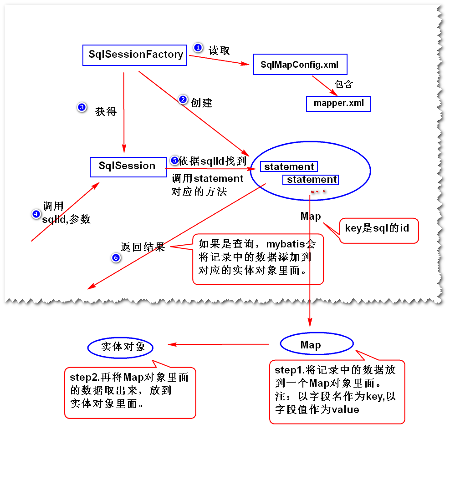
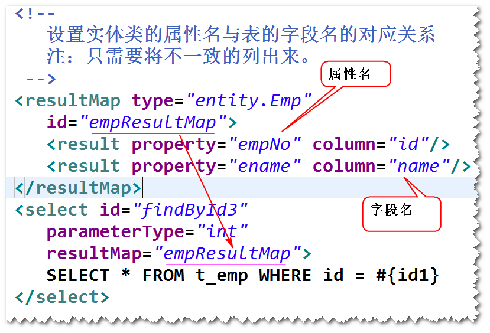
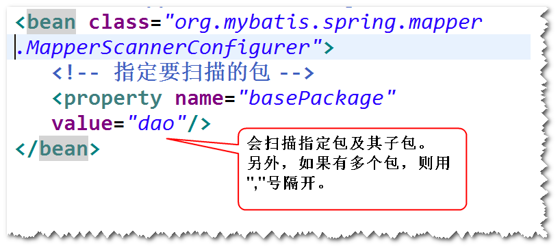
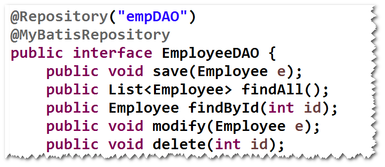
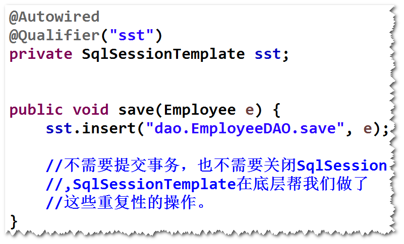

# MyBatis-day01

## (1)MyBatis是什么?
	开源的持久层框架
	注：底层仍然是jdbc。
	jdbc   速度快，易掌握，要写sql,代码繁琐
	mybatis 速度适中　易掌握，要写sql,代码简洁
	hibernate 速度慢，比较难掌握，不用写sql,代码简洁
				如果业务复杂，经常需要优化sql

## (2)如何使用MyBatis?
	step1. 导包
		mybatis,ojdbc,junit
	step2. 添加mybatis配置文件
		注：
			主要是连接池的配置和映射文件的位置。
			mybatis自带了一个连接池。
	step3. 实体类
		注：
			属性名要与表的字段名一样（忽略大小写）	
	step4. 添加映射文件
		注：
			主要是一些sql语句
	step5. 修改配置文件，指定映射文件的位置。	
	step6. 调用MyBatis的api来访问数据库。

##　(3)工作原理(了解)
			

##  (4)获得Map类型的结果
	MyBatis在查询时，会将记录中的数据先存放到一个Map对象里面（
	以字段名作为key,以字段值作为value）,接下来，再将Map对象
	中的数据添加到实体对象里面。
	获得Map类型的结果，指的是获得这个Map对象（这样，可以不用写
	实体类）。
	注：
		实际使用当中，建议还是获得实体对象,这样获取数据时更方便。

## (5)解决表的字段名与实体类的属性名不一致的情况
	1)方式一　使用别名
		注：将别名设置成与属性名一样。
	2)方式二　使用resultMap
	

## (6)Mapper映射器
###　1)Mapper映射器是什么?
	是一个符合映射文件要求的接口。
	注：MyBatis会生成一个符合该接口要求的对象。	
###  2)如何使用Mapper映射器　
	step1.写一个接口
	a.　方法名要与映射文件当中的sqlId一样。
	b.	参数类型要与映射文件当中的parameterType一样。
	c. 	返回类型要与映射文件当中的resultType一样。
	

	step2.修改映射文件
		将namespace设置为接口名（要写接口的完整的名字)
	

	step3.调用SqlSession对象的getMapper方法来获得映射器的实现
					
	

# MyBatis-day02

## 1. Spring集成MyBatis
### (1)集成方式一　（使用Mapper映射器）
	step1.导包
		spring-webmvc,mybatis,mybatis-spring
		ojdbc,dbcp,spring-jdbc,junit

	
	step2.添加Spring配置文件
		注：不再需要MyBatis的配置文件，MyBatis相关的配置用一个
		bean来代替（SqlSessionFactoryBean）。
	step3.配置SqlSessionFactoryBean

	step4.实体类
	step5.映射文件
	step6.Mapper映射器
	step7.配置MapperScannerConfigurer。
		注：会扫描指定包及其子包下面的所有的Mapper映射器，
		然后调用SqlSession的getMapper方法（该方法会返回
		符合Mapper映射器要求的对象），并且将这些对象添加到
		Spring容器里面（默认的id是首字母小写之后的接口名）。

	step8.启动Spring容器，获得DAO对象。

	注：如果只扫描特定的接口
		step1. 开发一个注解
		step2. 将该注解添加到要扫描的接口之上

		step3. 修改MapperScannerConfigurer的配置	
	

### (2)集成方式二　（不使用Mapper映射器）
	注：方式二是早期的一种集成方式，使用较少。
	step1.导包
		spring-webmvc,mybatis,mybatis-spring
		ojdbc,dbcp,spring-jdbc,junit
	step2.添加Spring配置文件。
	step3.配置SqlSessionFactoryBean。
	step4.实体类。
	step5.映射文件。
			注：namespace没有要求。
	step6.DAO接口
			注：不要求与映射文件一致。
	step7.写DAO实现类
			注：　注入SqlSessionTemplate
			(SqlSessionTemplate封装了对SqlSession的操作)。
	
	

	step8.启动Spring容器，获得DAO对象。
			注：不要忘记添加组件扫描。

	SpringMVC + Spring + MyBatis完成登录

	step1.添加一些包 (mybatis,mybatis-spring)
	step2.在Spring配置当中，添加SqlSessionFactoryBean
		的配置，注意mapperLocations的值。
	step3.实体类User( 不用写了，但是要注意属性名与
		表的字段名不一致。建议使用别名)
	step4.添加userMapper.xml。
		namespace="cn.tedu.ems.dao.UserDAO"
		<select id="findByUsername" 
			parameterType="java.lang.String"
			resultType="cn.tedu.ems.entity.User">
			SELECT password pwd...
		</select>
	step5.Mapper映射器(不用写了，UserDAO就是)
	step6.配置MapperScannerConfigurer
	step7.测试UserDAO
	step8.测试整个登录			