# Servlet-day01 #
## 1. 什么是Servlet?  
	sun(oracle)公司制订的一种用来扩展web服务器功能的组件规范。
### (1)扩展web服务器功能
	web服务器（比如apache webserver,iis等）只能够处理静态资源的
	请求（需要事先将静态页面写好），不能够处理动态资源的请求（需要
	进行计算，然后生成相应的页面）。所以，需要扩展web服务器的功能。
	注：早期使用CGI(Common Gateway Interface通用网关接口)程序来
	扩展,因为性能不好，可移值性差，已经不怎么用了。
	servlet可以用来扩展web服务器功能（web服务器收到请求之后，如果
	需要计算，则调用servlet容器来处理，servlet容器会调用servlet来
	计算）。

### (2)组件规范
	1)什么是组件?
	符合规范，实现部分功能，需要部署到相应的容器里面才能运行的
	软件模块。
	2)什么是容器?
	符合规范，提供组件的运行环境的程序。
	servlet是一个组件，需要部署到相应的容器里面才能运行，比如
	需要部署到(Tomcat)才能运行。

## 2.如何写一个servlet?
	step1.  写一个java类，实现Servlet接口或者继承
			HttpServlet。
	step2.  编译  
	step3.  打包
				appname(应用名)
				  WEB-INF
					classes(字节码文件)
					lib(可选，放jar文件)
					web.xml(描述文件)
	step4.　部署
				将step3创建好的文件夹拷贝到容器指定的某个文件夹下面。
			注：
				也可以将step3创建好的文件夹使用jar命令压缩成
				以.war为后缀的文件，然后再拷贝。
	step5. 启动容器，访问servlet。
			注：
				打开浏览器输入
				http://ip:port/appname/url-pattern
			
## 3. servlet是如何运行的?
	比如，打开浏览器，输入
	http://ip:port/servlet-day01/hello

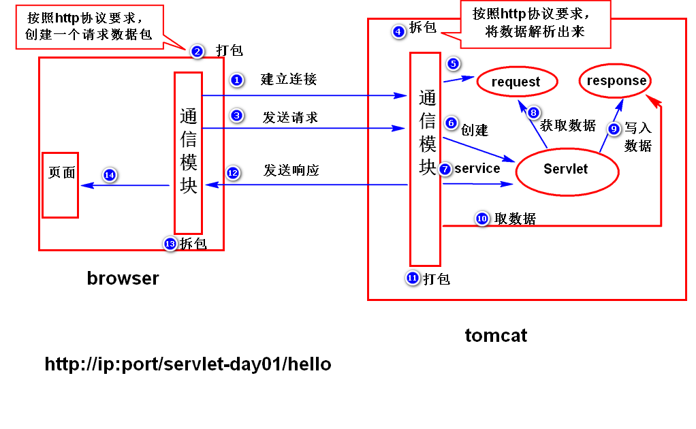

	step1. 浏览器依据ip,port建立与web服务器之间的连接。
	注：servlet容器同时也是一个简单的web服务器。
	step2. 浏览器将相关数据打包（即按照http协议要求，创建一个
	请求数据包），然后发送给web服务器。
	step3. web服务器拆包（即按照http协议要求，将请求数据包中的
	相关数据解析出来），然后将解析到的数据添加到request对象里面，
	同时，创建一个response对象。
	step4. web服务器创建servlet对象，然后调用该对象service方法来
	处理请求。
		注：在service方法里面，可以通过request对象获取请求数据包
		里面的数据，同时，可以将处理结果写到response对象里面。
	step5. web服务器会将response对象中的数据取出来，打包（即按照
	http协议创建响应数据包），然后发送给浏览器。
	step6. 浏览器拆包（按照http协议要求，将响应数据包中的数据解析
	出来），然后生成相应的页面。

## 4.常见的错误及解决方式
### (1)404
	注：404是一个状态码（状态码是一个三位数字，由http协议制订，
	表示服务器处理请求的一种状态），表示依据请求路径，找不到对应
	的资源。
	1)原因：
		a.地址写错。
		b.忘记部署
	2)解决方式:
		a.先检查应用是否已经部署
		b.按照http://ip:port/appname/url-pattern检查地址
### (2)500
	注:500也是一个状态码，表示服务器出错。
	1)原因
		a.程序运行出错。
		b.没有继承HttpServlet。
		c.<servlet-class>配置的类名写错。
	2)解决方式
		a.程序代码要写严谨。比如对请求参数值作合法性检查。
		b.继承HttpServlet。
		c.类名一定要完整、正确。
### (3)405
	注：405也是一个状态码，表示找不到处理请求的方法。
	1)原因
		service没有按照规定去写。
	2)解决方式
		按照service方法的要求去写。

			
# Servlet-day02 #
## 1 http协议　（了解）   　
### (1)什么是http协议?
	是一种网络应用层协议，规定了浏览器与web服务器之间如何通信以及
	通信所使用的数据格式。
	应用层:http协议 传输层:tcp协议 网络层:IP协议
	1)如何通信
		step1. 	建立连接
		step2.　浏览器打包，发送请求
		step3.	服务器打包，发送响应
		step4.	关闭连接
		即一次请求，一次连接。
		如果要再发送请求，需要再次建立新的连接。
		优点：web服务器可以利用有限的连接为尽可能多的客户请求服务。
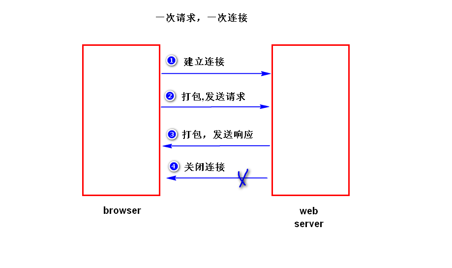

	2)数据格式
		a.请求数据包
			a1. 请求行　(请求类型　请求资源路径　协议类型和版本)
			a2. 若干消息头　
				注：消息头是一些健值对，由http协议规定，通信的双方
				可以使用消息头来传递一些特定的信息。比如浏览器可以
				通过发送"user-agent"消息头，告诉服务器，浏览器的类型和版本。
		    a3. 实体内容
				如果发送的是get请求，实体内容为空。
				如果发送的是post请求，实体内容不为空（里面是
				请求参数）			
		b.响应数据包
			b1.状态行　(协议类型和版本　　状态码(200正常)　状态描述)
			b2.消息头　
				　服务器也可以发送一些消息头给浏览器，比如发送
				  "content-type"消息头，告诉浏览器，服务器返回
				　的数据类型和编码。
			b3.实体内容
					存放程序处理的结果
### (2)两种请求类型
	1)浏览器哪一些情况下，会发送get请求?
		a.直接输入某个地址
		b.点击链接
		c.表单默认的提交方式
	2)get请求的特点
		a.会将请求参数添加到请求资源路径的后面（即请求行里面
		请求行只能存放大约2k左右的数据)，只能提交少量的数据。
		b.会将请求参数显示在浏览器地址栏，不安全（比如，路由
		器会记录包含有请求参数的地址）。
	3)浏览器哪一些情况下，会发送post请求?
		a.设置表单的method属性值为post。
	4)post请求的特点
		a.会将请求参数添加到实体内容里面，可以提交大量的数据。
		b.不会将请求参数显示在浏览器地址栏，相对安全（注意，
		不会加密，对于敏感数据需要加密处理)。

## 2. Servlet输出中文，如何处理乱码问题?
### (1)为什么会有乱码?
	out.println方法在输出时，默认使用"iso-8859-1"来编码。
### (2)如何解决?
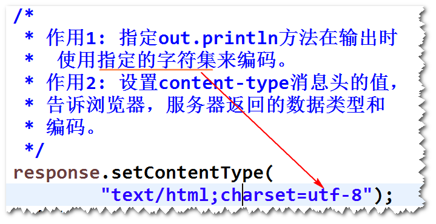

练习：

# Servlet-day03 #
## 1. 表单中文参数值乱码问题
### (1)为什么会有乱码?
	表单提交时，浏览器会对表单中的中文参数值进行编码（会使用打开
	该表单所在的页面时的字符集来编码），服务器端默认会使用
	"iso-8859-1"来解码。所以会产生乱码。
### (2)如何解决
	1)post请求
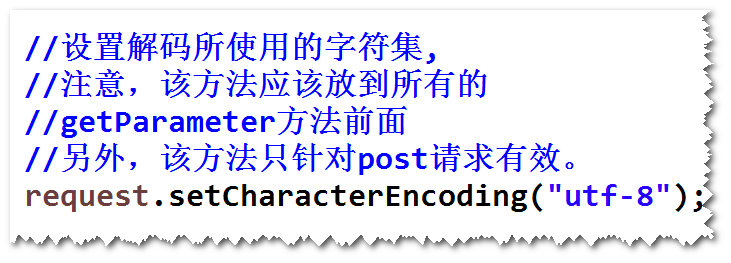

	2)get请求
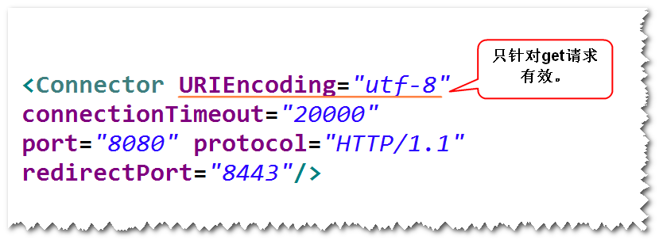

## 2. servlet访问数据库
	step1. 导包
	ojdbc,dbcp,junit
	step2. 将config.properties文件添加到resource文件夹下面
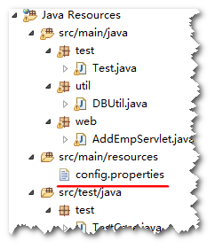
	
	step3. 修改DBUtil类。
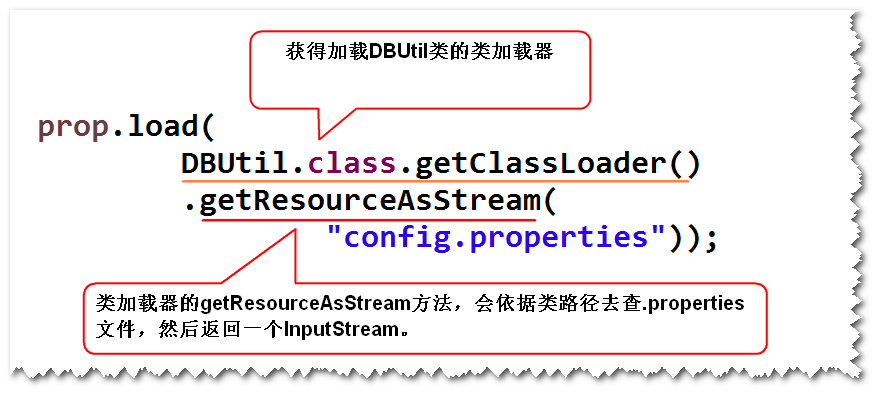

	step4. 测试DBUtil类。
	注：可以使用junit来测试(junit是一个单元测试工具)。
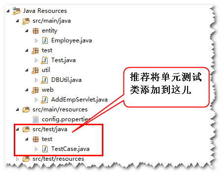
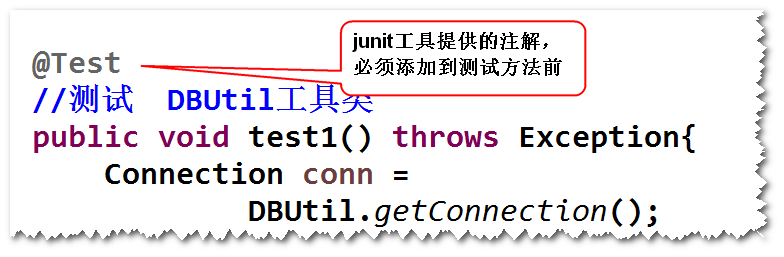

	step5.　建立t_emp表
	
	create table t_emp(
		id number(8) primary key,
		name varchar2(50),
		salary number(8,2),
		age number(3)
	);
	create sequence t_emp_seq;
	
	step6. 添加Employee类。
	step7. 添加EmployeeDAO类，并测试。
	step8. AddEmpServlet调用EmployeeDAO。

练习：
	写一个DelEmpServlet，依据id删除某个员工。
	比如
		http://ip:port/servlet-day03/del?id=1
	提示：
		在EmployeDAO中添加一个delete方法。
	

# Servlet-day04 #
	
## 1. 重定向
### (1)什么是重定向?
	服务器通知浏览器向一个新的地址发送请求。
	注：通常服务器发送一个302状态码以及一个Location消息头
	（该消息头的值是一个地址，即重定向地址），浏览器收到之后，
	会立即向重定向地址发送请求。
### (2)如何重定向?
	response.sendRedirect(String url)。
	注：url即重定向地址。
### (3)重定向之前，容器会先清空response对象上存放的所有的数据。
### (4)特点
	1)重定向地址是任意的
	2)重定向之后，浏览器地址栏的地址会发生改变
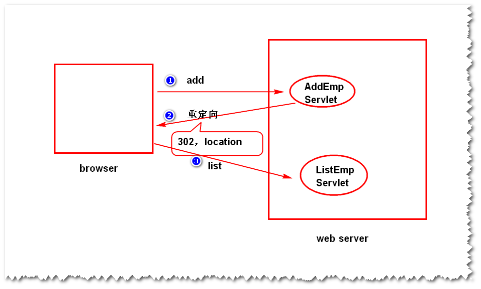

## 2. 读取请求参数值
### (1)String request.getParameter(String name);
	注意:
		a.如果请求参数名与实际的请求参数名不一致，会得到null值。
		b.表单提交时，如果没有填写任何数据，会得到""。
### (2)String[] request.getParameterValues(String name);
	注意:
		a.当有多个请求参数名相同时，使用该方法。
		b.对于多选框，如果一个都不选，则浏览器不会将多选框的值
		发送给服务器。（也就是说，会获得null值）。

# Servlet-day05 #

## 1. servlet的生命周期
### (1)什么是servlet的生命周期?
	容器如何创建servlet对象，如何对其进行初始化，如何调用
	servlet对象处理请求，以及如何销毁servlet对象的整个过程。
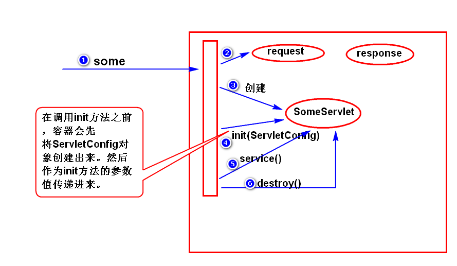

### (2)生命周期分成哪几个阶段？
	1)实例化
		a.什么时候实例化?
			情形一（默认）：容器收到请求之后，才会创建。
			情形二: 容器启动之后，立即创建。需要配置：
		b.注意：容器在默认情况下，只会创建一个实例。
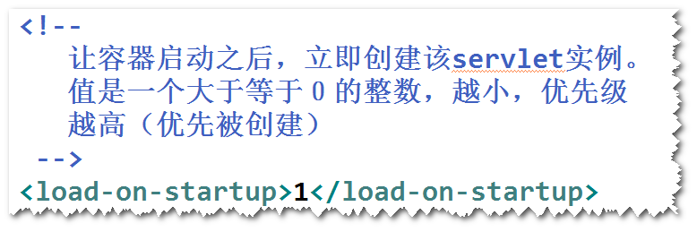

		
	2)初始化
		a.什么是初始化?
			容器在创建好servlet对象之后，会立即调用该对象的
			init方法。
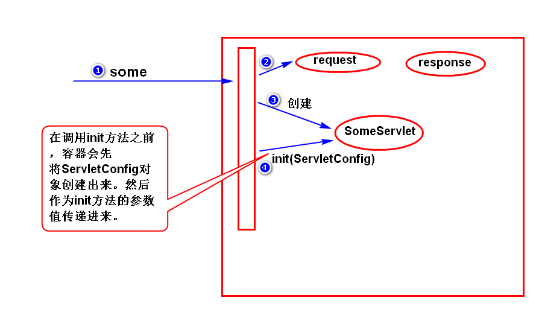

		b.init方法
			b1.GenericServlet已经实现了init方法。
			注意（了解）: 会将容器传进来的ServletConfig对象保存下	来，并且提供了一个getServletConfig方法来获得
				ServletConfig对象。
			b2.init方法只会执行一次。
			b3.可以override init()方法来扩展。
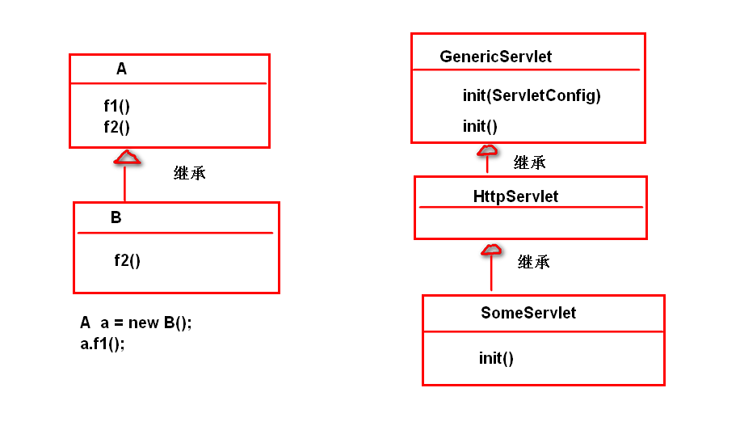

		c.初始化参数
			step1.配置初始化参数
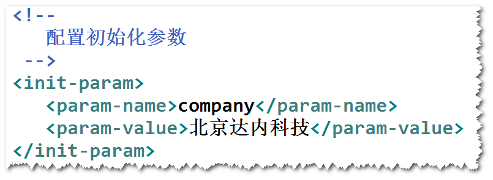
			
			step2.调用ServletConfig提供的getInitParameter方法
			
	3)就绪(调用)
		a.什么是就绪?
			容器收到请求之后，调用servlet对象的service方法来
			处理请求。
		b.service方法
			b1. HttpServlet已经实现了service方法：
			依据请求类型调用对应的方法（比如，get请求会调用
			doGet方法）。
			b2. 可以选择override HttpServlet的service方法或者
			override HttpServlet的doGet和doPost方法。
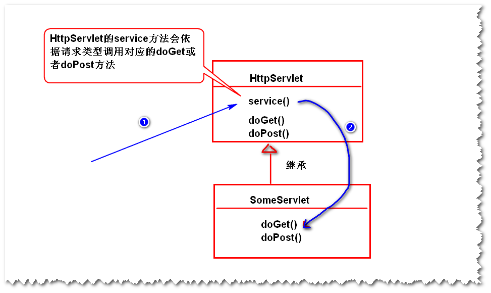

	4)销毁
		a.什么是销毁?
			容器在销毁servlet对象之前，会调用该对象的
			destroy方法。
		b. destroy方法。
			b1.GenericServlet已经实现了该方法。
			b2.可以override destroy方法。
			b3.只会执行一次。

### (3)生命周期相关的几个类和接口。
	1)Servlet接口
		init()
		service()
		destroy()
	2)GenericServlet抽象类
		实现了Servlet接口中的init和destroy方法。
	3)HttpServlet抽象类
		继承GenericServlet，实现了service方法。	

## 2. jsp (java server page)	
### (1)什么是jsp?
	sun公司制订的一种服务器端的动态页面技术规范。
	注：因为直接使用servlet虽然也可以生成动态页面，但是
	过于繁琐（需要使用out.println语句输出），并且不利于
	页面的维护（需要修改java源代码），所以sun才制订了jsp
	技术规范。
### (2)如何写一个jsp?
	注：jsp是一个以.jsp为后缀的文件(该文件的内容主要是html和　
	少量的java代码),该文件会被容器转换成一个servlet然后执行。
	step1. 写一个以.jsp为后缀的文件。
	step2. 在该文件当中，可以添加如下内容:
		1)html(css,javascript) 
			直接写即可。
		2)java代码。
			a. java代码片断
			<%  java代码   %>
			b. jsp表达式
			<%= java表达式 %>
		3)隐含对象。
			a.什么是隐含对象?
				在jsp文件里面，可以直接使用的对象，比如out,request,response。
			b.为什么可以使用这些隐含对象?
				因为容器会自动添加获得这些对象的语句。
		4)指令
			a.什么是指令?
				告诉容器，在将jsp文件转换成java文件时，做一
				一些额外的处理，比如导包。
			b.语法
				<%@ 指令名　　属性=值 %>
			c.page指令
				import属性：导包，比如
					<%@ page import="java.util.Date"%>
					<%@ page import="java.text.*"%>
				也可以简化成 <%@ page 	import="java.util.Date,java.text.*"%>
				contentType属性：设置response.setContentType
					方法的参数值。
				pageEncoding属性：告诉容器，在读取jsp文件的
					内容时，使用指定的字符集来解码。
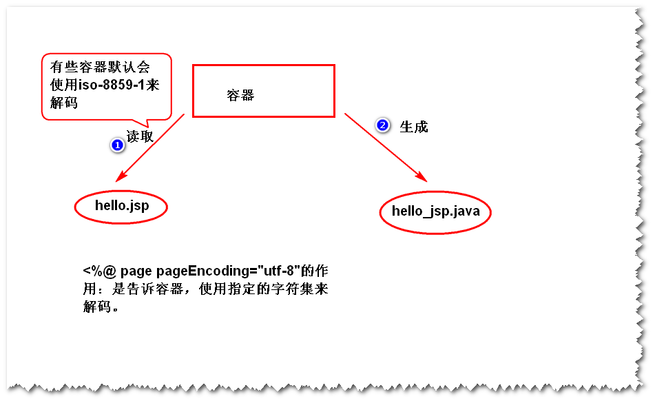

### (3)jsp是如何运行的?
	1)阶段一　　容器要将.jsp文件先转换成一个.java文件（也就是
				一个servlet）。
		a. html   ----->   会在service方法里，使用out.write
						输出。
		b. <%  %>  ---->　　会在service方法里，照搬过来。
		c. <%= %>  ---->    会在service方法里，使用out.print
						输出。
	2)阶段二　　容器调用该servlet来处理请求（包括实例化，初始化...）	

	
	
	
# Servlet-day06 #

## 1. 转发
### (1)什么是转发?
	一个web组件将未完成的任务转交给另外一个web组件继续做。
	(通常是servlet将一些数据转交给jsp来展现)。
	注：web组件指的是servlet或者是jsp。
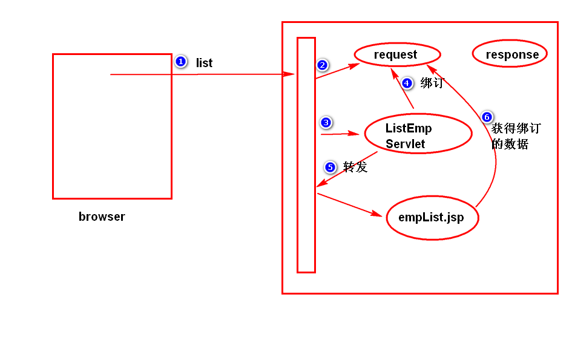

###　(2)如何转发?
	step1. 将一些数据绑订到request对象上。
		request.setAttribute(String name,Object obj)
		注: name是绑订名，obj是绑订值。
		注：可以依据绑订名获得绑订值：
		 Object request.getAttribute(String name); 
	step2. 获得转发器。
		RequestDispatcher rd = 
			request.getRequestDispatcher(String url);
		注: url指是的另外一个web组件的地址（比如某个jsp）。
	step3.　调用转发器的方法来转发
		rd.forward(request,response);
### (3)特点
	a.转发之后，浏览器地址栏的地址不变。
	b.转发的地址有限制（同一个web应用）。

## 2. 容器如何处理请求资源路径  
	比如，输入http://ip:port/servlet-day06/abc.html
	注：/servlet-day06/abc.html　就是请求资源路径
	step1. 容器默认认为访问的是一个servlet。
	step2. 容器在web.xml文件当中，查找与请求地址匹配的servlet。
		匹配规则:
			1)精确匹配　　<url-pattern>的值必须是"/abc.html"
			2)通配符匹配	 
					使用 * 表示零个或者多个任意的字符。
					比如
						<url-pattern>/*</url-pattern>
						<url-pattern>/demo/*</url-pattern>
			3)后缀匹配 
					使用 *.开头，后接任意的多个字符。
					比如
						<url-pattern>*.do</url-pattern>	
					匹配所有以.do结尾的请求。
	step3. 如果找不到匹配的servlet,会查找对应位置的文件，
			如果找到了，则返回，找不到，则返回404。

## 3. 如何将多个servlet合并成一个?
	step1. 	将servlet配置成后缀匹配，比如
			<url-pattern>*.do</url-pattern>	
	step2.  分析请求资源路径，依据分析结果，调用不同的
			分支来处理。

# Servlet-day07

## 1.　比较转发与重定向
###	(1)能否共享request和response
	转发可以，重定向不行。
	注：
		容器收到请求之后，会立即创建request和response，
		一旦响应发送完毕，则容器会立即销毁这两个对象。
		即request和response的生存时间为一次请求与响应期间存在。
###	(2)浏览器地址栏地址是否会发生变化
	转发不变，重定向会变。
###  (3)目的地是否有限制
	转发有限制（要求是同一个应用），重定向没有。

## 2.路径问题
	链接地址　表单提交　重定向　转发
	
	<form action="">
	response.sendRedirect("")
	request.getRequestDispatcher("")
### (1)相对路径
	什么是相对路径？
	不以"/"开头的路径
### (2)绝对路径
	1)什么是绝对路径?
		以"/"开头的路径
	2)如何写绝对路径?
		链接地址，表单提交，重定向从应用名开始写；
		转发从应用名之后开始写。
	注：　尽量避免直接将应用名写在地址里面，而应该使用
		String request.getContextPath()来代替。
### (3)建议：尽量优先使用绝对路径。

## 3. 状态管理
### (1)什么是状态管理?
	将浏览器与web服务器之间多次交互当做一个整体来看待（即为了
	完成某个业务，需要多次交互，比如购物），并且将多次交互
	所涉及的数据（即状态）保存下来。
### (2)如何进行状态管理?
	1)客户端状态管理
		将状态保存在客户端（浏览器）。
		常见的技术有Cookie。
	2)服务器端状态管理
		将状态保存在服务器端。
		常见的技术有Session。(会话)
### (3)Cookie
	1)什么是Cookie?
		服务器临时存放在浏览器端的少量的数据。
	2)工作原理
		浏览器访问服务器时，服务器将少量数据以set-cookie
		消息头的方式发送给浏览器；浏览器会将这些数据临时
		保存下来，当浏览器再次访问服务器时，会将这些数据
		以cookie消息头的方式发送给服务器。
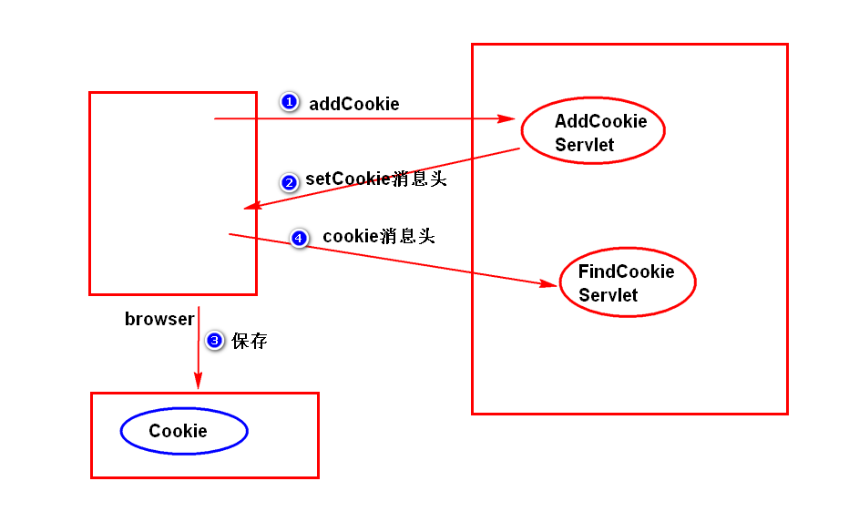

	3)添加cookie?
		Cookie c = new Cookie(String name,String value);
		response.addCookie(c);
	4)查询cookie?
		Cookie[] request.getCookies();
		注：有可能返回null。
		cookie.getName()
		cookie.getValue()
	5)cookie的生存时间
		默认情况下，浏览器会将cookie保存在内存里面。
		（浏览器不关闭，cookie一直在）。
		可以调用 cookie.setMaxAge(int seconds)方法来设置
		cookie的生存时间。
			注意：
				a.单位是秒
				b.当 seconds > 0,浏览器会将cookie保存在硬盘上，
				超过指定的时间，浏览器会销毁该cookie。
				c.当 seconds < 0,保存在内存里面（缺省值）。
				d.当 seconds = 0,浏览器会立即删除该cookie。
					比如，要删除一个名称为"cart"的cookie。
					Cookie c = new Cookie("cart","");
					c.setMaxAge(0);
					response.addCookie(c);
	6)编码问题
		cookie只能保存合法的ascii字符。中文显示不属于ascii字符，
		需要将中文进行编码处理（也就是说，将中文转换成相应的ascii
		字符串的形式）。
			String URLEncoder.encode(String str,String charset)
			String URLDecoder.decode(String str,String charset)
		注：保存cookie时，尽量都编码处理。
			
	7)cookie的路径问题
		a.什么是cookie的路径问题?
			浏览器访问服务器上的某个地址时，会比较该地址是否与
		cookie的路径匹配，只有匹配的cookie才会被发送。
			匹配规则：
				要访问的地址（路径）必须等于cookie的路径或者
			是其子路径。
		b.默认路径
			默认路径等于添加该cookie的组件的路径。
			比如
				/servlet-day07-2/app01/addCookie.jsp添加了
			一个cookie,则该cookie默认的路径是"/servlet-day07-2/app01"
		c.如何修改cookie的路径?
			cookie.setPath(String path);
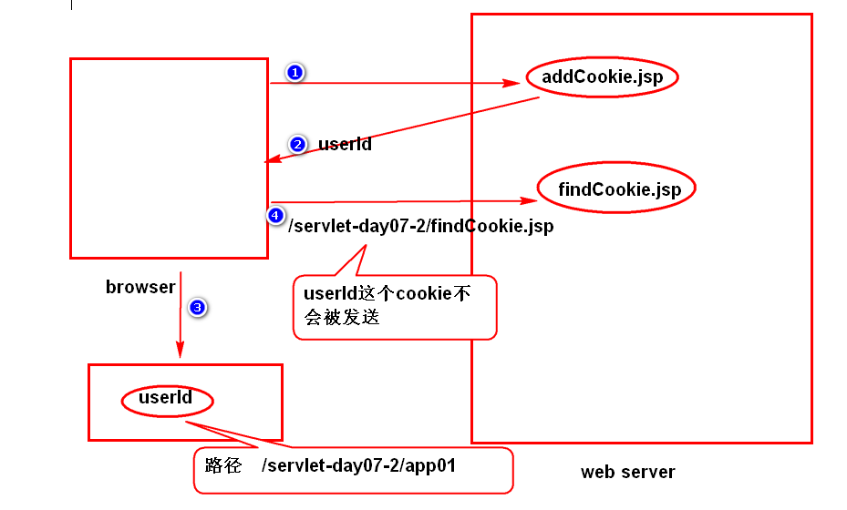

	8)cookie的限制
		a. cookie是可以被用户禁止的。
		b. cookie只能保存少量的数据。（大约是4k左右）
		c. 浏览器通常只允许保存几百个cookie。
		d. cookie不安全。（如果需要将敏感数据，比如帐号密码以
			cookie的方式保存在浏览器端，一定需要加密）。
		
		

# Servlet-day08

## 1. Session （会话）
### (1)什么是Session?
	服务器端为了保存状态而创建的一个特殊对象。
### (2)工作原理
	浏览器访问服务器时，服务器会创建一个session对象（该对象
	有一个唯一的id,一般称之为sessionId）,服务器会将这个
	sessionId以cookie的形式发送给浏览器，浏览器会保存下来。
	当浏览器再次访问服务器时，会将sessionId以cookie的形式发
	发送给服务器，服务器会依据sessionId找到对应的session对象。
### (3)如何获得session对象?
	1)方式一
		HttpSession s = request.getSession(boolean flag)。
		注：
		当flag为true时:先查看请求当中是否有sessionId,如果没有，
		则创建session对象。如果有sessionId,则依据sessionId去
		查找对应的session对象，找到了，则返回；如果找不到，则
		创建一个新的session对象。
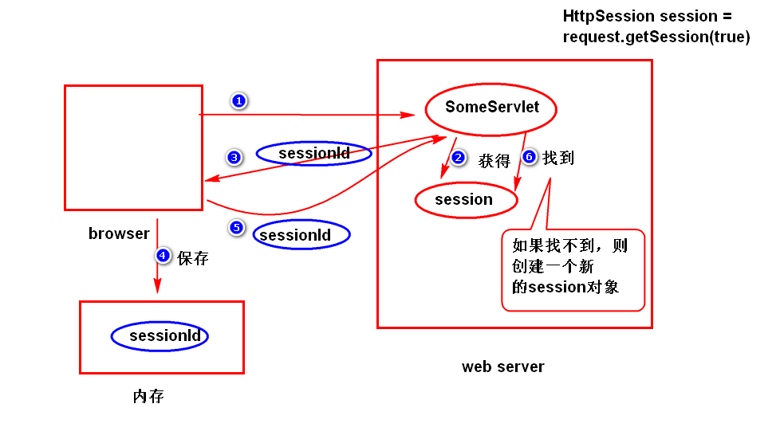

		当flag为false时：先查看请求当中是否有sessionId,如果没有，
		会返回null。如果有sessionId,则依据sessionId去
		查找对应的session对象，找到了，则返回；如果找不到，返回
		null。
	2)方式二
		HttpSession s = request.getSession();
		等价于  request.getSession(true)	。
	
###　(4)绑订数据
	//绑订数据
	setAttribute(String name,Object obj)
	//依据绑订名获得绑订值
	Object getAttribute(String name)
	//解除绑订
	removeAttribute(String name)
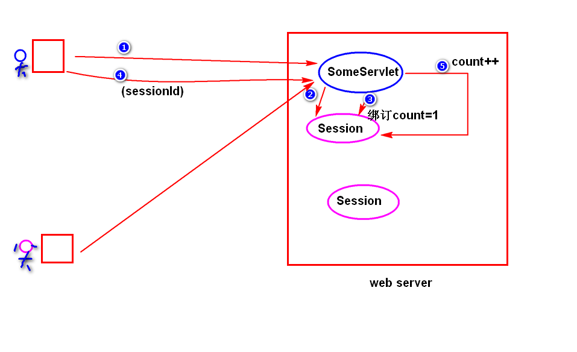
		
### (5)session超时
	1)什么是session超时?
	服务器会将空闲时间过长的session对象删除掉。
	注：
		服务器默认的空闲时间一般是半个小时（可以修改服务器的配置）。(如果修改服务器的配置,则影响所有应用)
		在Servers文件中的web.xml文件中修改
		<session-config>
        	<session-timeout>30</session-timeout>
    	</session-config>
	2) setMaxInactiveInterval(int seconds)
### (6)删除session
	session.invalidate()		
		 

## 2. 登录
	step1.建表
	create table t_user(
		id number(8) primary key,
		username varchar2(50),
		password varchar2(20),
		name varchar2(100),
		gendar char(1)
	);	
	
	alter table t_user add constraint username_unique unique(username);

	create sequence t_user_seq;

	insert into t_user values(t_user_seq.nextval,'Sally','1234','Sally Tong','f');
	commit;
		
	step2.实体类　User
	step3.导包（ojdbc,dbcp,junit）
	step4.UserDAO类
			public User findByUsername(String username)
	step5.login.jsp,index.jsp,error.jsp
	step6.ActionServlet

## 3. session验证
	step1. 在登录成功以后，在session对象上绑订一些数据。比如
			session.setAttribute("user",user);
	step2. 对于需要登录之后才能访问的地址，进行session验证：
			Object obj = session.getAttribute("user");
			if(obj == null){
				response.sendRedirect("login.jsp");
			}	
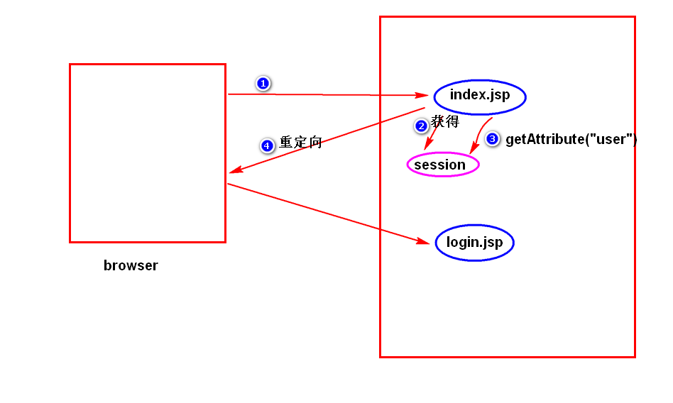

# Servlet-day09
## 1. 比较session和cookie
### (1)优点
	session相对于cookie,要安全一些，能保存更丰富的数据类型，
	能保存更多的数据。
### (2)缺点
	session是将状态保存在服务器端，如果用户量大，会占用大量的
	内存空间。

## 2. 过滤器
### (1)过滤器是什么?
	servlet规范当中定义的一种特殊的组件，servlet容器在收到请求之后，
	会先调用过滤器，再调用servlet。
### (2)如何写一个过滤器?
	step1. 写一个java类，实现Filter接口。
	step2. 在doFilter方法里面，编写处理逻辑。
	step3. 配置过滤器(web.xml)。
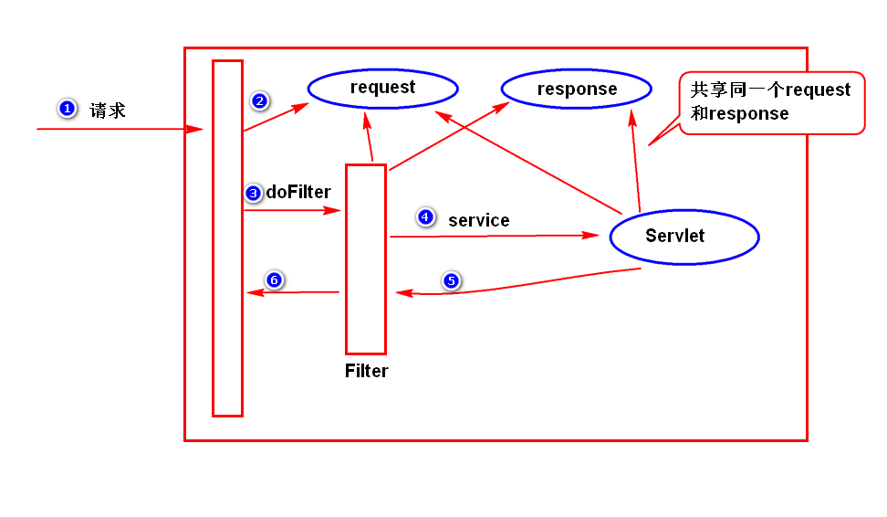

### (3)过滤器的优先级
	如果有多个过滤器都满足拦截要求，容器会依据<filter-mapping>
	配置的先后顺序来执行。

### (4)初始化参数
	step1.配置初始化参数。
	step2.调用FilterConfig提供的getInitParameter方法。

## 3.监听器
### (1)监听器是什么?
	servlet规范当中定义的一种特殊的组件，用来监听容器产生的
	事件并进行处理。
	注：容器会产生两大类事件：
	1)生命周期相关的事件：容器创建或者销毁了request,session
		以及servlet上下文时产生的事件。
	2)绑订数据相关的事件：执行了setAttribute,removeAttribute
		产生的事件。
### (2)如何写一个监听器?
	step1. 写一个java类，实现监听器接口。
	注：依据监听的事件类型，选择相应的监听器接口，比如，
		要监听session对象的创建和销毁，需要实现
		HttpSessionListener接口。
	step2. 在监听器接口方法当中，实现监听处理逻辑。
	step3. 配置监听器。
### (3)Servlet上下文
	1)Servlet上下文是什么?	
	容器启动之后，会为每一个web应用创建唯一的一个符合
	ServletContext接口要求的对象，该对象一般称之为
	Servlet上下文。
		该对象有两个特点：
		a.唯一性：一个web应用对应一个servlet上下文。
		b.一直存在：容器只要没有关闭或者应用没有被卸载，
				servlet上下文会一直存在。
	2)如何获得Servlet上下文?
		GenericServlet:getServletContext();
		HttpSession: session.getServletContext();
		ServletConfig: config.getServletcontext();
		FilterConfig: config.getServletContext()。
	3)作用
		a. 绑订数据  
				setAttribute,getAttribute,removeAttribute
		b. 读取全局的初始化参数
			step1.配置初始化参数
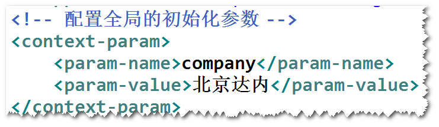
			
			step2.读取（通过ServletContext提供的getInitParameter方法）

## 验证码（扩展）
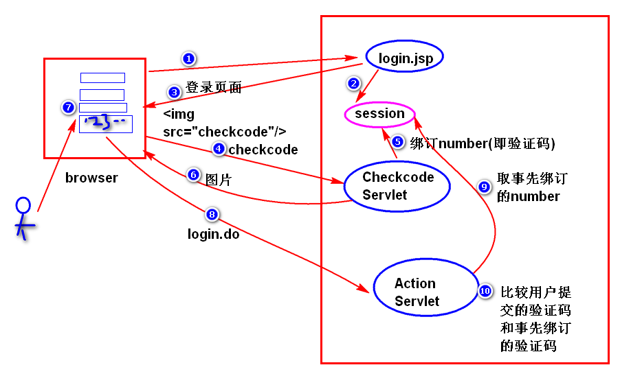
		
		

# ServletJsp-day10 #

## 1. Servlet线程安全问题
### (1)为什么说Servlet会有线程安全问题?
	a.容器在默认情况下，只会创建一个Servlet实例（即一个对象）。
	b.容器收到请求之后，会启动一个线程来处理请求，就有可能有多个
	线程同时调用某个Servlet（比如，都要去修改Servlet的某个属性），
	就有可能产生线程安全问题。 
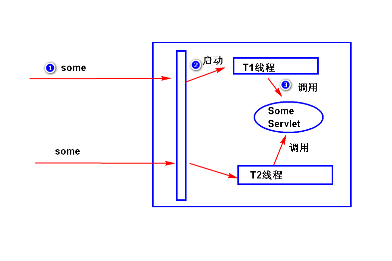

### (2)如何解决?
	使用synchronized加锁。

#	Servlet小结
	## 1.Servlet基础
		(1)什么是Servlet?
		(2)什么是Servlet容器?
		(3)如何写一个Servlet?
		(4)Servlet是如何运行的?
		(5)Http协议（了解）
			1)什么是http协议?
			2)特点
			3)请求数据包和响应数据包的结构
				a.消息头
				b.状态码(200,500,404,302,405)
			4)两种请求类型(get/post)		
	## 2.Servlet核心
		(1)如何获取请求参数值?
		(2)表单包含有中文参数值，如何处理?
		(3)输出中文
		(4)重定向和转发
			1)什么是重定向
			2)如何重定向
			3)重定向的特点
			4)什么是转发
			5)如何转发
			6)转发的特点
			7)比较重定向和转发
		(5)Servlet生命周期
			1)什么是Servlet的生命周期?
			2)分成哪几个阶段?
			3)Servlet什么时候实例化?
			4)初始化参数
			5)doGet/doPost
			6)Servlet,GenericServlet,HttpServlet,ServletConfig
		(6)ServletContext
			1)什么是ServletContext?
			2)特点
			3)作用
		(7)路径问题
			1)什么是相对路径?
			2)什么是绝对路径?
			3)如何写绝对路径?
		(8)线程安全问题
			1)为什么说Servlet会有线程安全问题?
			2)如何解决?
		(9)容器如何处理请求资源路径?
		(10)一个Servlet如何处理多种请求?
	## 3.状态管理
		(1)什么是状态管理?
		(2)Cookie
			1)什么是Cookie?
			2)Cookie的工作原理
			3)如何添加Cookie?
				a.编码问题
				b.生存时间问题
				c.路径问题
			4)如何读取Cookie?
			5)Cookie有哪些限制?
		(3)Session
			1)什么是Session?
			2)Session的工作原理
			3)如何获得Session?
			4)绑订数据
			5)Session超时
			6)删除Session	
	## 4.数据库访问
	## 5.过滤器与监听器
			1)什么是过滤器?
			2)如何写一个过滤器?
			3)优先级
			4)初始化参数
			5)什么是监听器?
			6)如何写一个监听器?	
	## 6.案例和扩展
			1)员工管理
			2)登录
				a.session验证
				b.验证码（扩展）

## jsp基础
## 1. jsp是什么?
## 2. 如何写一个jsp?
	step1. 写一个以.jsp为后缀的文件
	step2. 添加:
	(1) html (css,js) : 直接写
	(2) java代码:
		1)java代码片断
		<%  java代码  %>
		2)jsp表达式
		<%= java表达式 %>
		3)jsp声明     (a1.jsp)
		<%!   声明一个变量或者一个方法  %>\
	(3) 指令
		1)什么是指令?
			告诉容器在将.jsp文件转换成.java文件时(Servlet),
			做一些额外的处理，比如导包。
		2)page指令
			import属性：导包
			contentType属性：设置response.setContentType方法
						的参数值。
			pageEncoding属性：告诉容器，在读取jsp文件时，使用
						指定的字符集来解码。
			session属性 (了解  a2.jsp)：缺省值为true,如果值为false,
						session隐含对象就不能用了。
			errorPage属性(了解 a3.jsp a4.jsp):用来指定一个异常处理
								页面。
			isErrorPage属性(了解): 缺省值为false,如果值为true,
						表示这是一个异常处理页面，可以使用
						exception隐含对象了。
		3)include指令 ((day03)empList.jsp) 
			file属性：告诉容器，在将.jsp文件转换成.java文件时，
			将file属性所指定的文件的内容 插入到 该指令所在的位置。
		4)taglib指令 
				导入jsp标签。
	(4)隐含对象
		1)什么是隐含对象?
			可以直接使用的对象
		2)为什么可以直接使用这些隐含对象?
			容器会添加获得这些对象的代码
		3)有哪一些隐含对象
			out,request,response
			session
			application
			exception (了解)
			pageContext: (a5.jsp a6.jsp)
				容器会为每一个jsp实例创建唯一的一个符合PageContext
				接口要求的对象。
				作用1：
					绑订数据 (setAttribute,getAttribute,removeAttribute)
					注：只有对应的jsp能访问到。
				作用2:
					可以获得其它所有隐含对象。
			config:(了解  a7.jsp)
				ServletConfig
			
			page (了解) jsp实例（jsp对应的servlet对象）
	
	(5)注释	(a8.jsp)
		1) <!-- 注释内容 --> 注释内容如果是java代码，会执行，
					但是，不会输出结果。
			
		2) <%--   --%>  注释内容如果是java代码，不会执行。 
 
## 3. jsp是如何执行的?
	阶段一： 容器将.jsp文件转换成.java文件（Servlet类）
		html ---->  service()方法里,使用out.write()输出。
		<%  %> ---> service()方法里,照搬。
		<%=  %> ---> service()方法里,out.print()输出。
		<%!  %> ----> 添加新的属性或者方法。
	阶段二：调用Servlet。

## jsp标签和el表达式
### (1)jsp标签是什么?
	jsp标签语法类似于html标签，用来替换jsp文件当中的java代码。
	注：
		因为直接在jsp文件当中写java代码，不利于jsp文件的维护
		（比如，将包含有大量java代码的jsp文件交给美工去修改就
		很不方便），所以，sun公司才制订了jsp标签技术规范。
### (2)el表达式什么?
	一套简单的运算规则，用于给jsp标签的属性赋值，也可以直接输出。
### (3)el表达式如何使用?
	1)访问bean的属性
		注:
			bean就是一个java类，有如下要求:
			a. public
			b. 有无参构造器
			c. 有一些属性以及对应的get/set方法
	   方式一 
			${user.name}  : 容器会依次从pageContext,request,
						session,application当中取绑订名为"user"
						的对象(getAttribute方法),接下来，调用
						该对象的"getName"方法,最后输出。
						注：
							a.会将null转换成""输出。
							b.如果依据绑订名找不到对应的对象,
							会输出""。
							c.可以使用pageScope,requestScope,
							sessionScope,applicationScope来指
							定查找范围。
	  方式二
		  ${user['name']} : 等价于 ${user.name}。
						注：
							a. []里面可以出现绑订名。${user[str]}:不带双引号
							b. []里面可以出现从0开始的下标 ${user[insert[0]]}
								（访问数组中的某个元素）。

# Servlet-day11

### (2) 进行一些简单的计算 (a1.jsp)
	注：计算结果可以直接输出，也可以用来给jsp标签的属性赋值。
	1)算术运算: + - * / %,注意，+ 运算只能求和。
	2)关系运算: > < >= <= == !=
	3)逻辑运算: && || !
	4)empty运算: 集合内容是否为空或者是否为一个空字符串。

### (3) 获取请求参数值 (a2.jsp)
	1) ${param.name}
		等价于 	request.getParameter("name")
	2) ${paramValues.interest}
		等价于  request.getParameterValues("interest")

## 2. jstl标签 (java standard tag lib)
### (1)jstl是什么?
	apache开发的一套jsp标签，后来捐献给了sun,sun将其命名为
	jstl。
### (2)几个核心标签
	1)编程步骤
		step1. 导包。
		step2. 使用taglib指令引入要使用的标签。
			<%@ taglib uri="http://xxx.xxx" prefix="c"%>
			注:
				uri 命名空间
					命名空间：为了区分同名的元素而添加的一个限定。
				prefix 前缀 
					前缀：可以理解为命名空间的别名。
	1)if标签  (a3.jsp)
		<c:if test="" var="" scope="">
			标签体
		</c:if>
		用法:
			当test属性值为true时，执行标签体的内容。
	 		test属性：可以使用el表达式进行计算。
			var属性：指定一个绑订名。
			scope属性：指定绑订的范围（"page","request","session","application"）。
			
	2)choose标签 (a4.jsp)
		<c:choose>
			<c:when test="">
			</c:when>
			...
			<c:otherwise>
			</c:otherwise>
		</c:choose>
		用法:
			when可以出现1次或者多次，otherwise可以出现0次或者1次。
			when表示一个分支，当test属性值为true会执行标签体的内容。
			otherwise表示例外。	
	3)forEach标签 (a5.jsp)
		<c:forEach items="" var="" varStatus="">
		</c:forEach>
		用法：
			遍历集合或者数组。
			items属性：用来指定要遍历的集合或者数组，可以使用el
					表达式。
			var属性：指定绑订名。注：绑订范围是pageContext。
				该标签每次从集合或者数组当中取一个元素，然后绑订
				到pageContext上。
			varStatus属性：指定绑订名。注：绑订范围是pageContext。
				该标签会创建一个用来封装当前遍历状态的对象，该
				对象会绑订到pageContext上。该对象有两个常用的方法
				getIndex():获得当前正在被遍历的元素的下标（从0开始）。
				getCount():获得当前正在被遍历的元素是第几个元素（从1开始)。

## 3. 自定义标签  (a6.jsp)
### (1)编程步骤
	step1. 写一个java类，继承SimpleTagSupport类。
	注：简单标签技术。
	step2. 在doTag方法里面，编写处理逻辑。
	step3. 在tld文件里面，描述标签。
		注：<body-content>empty</body-content>
		值可以是:
			empty 该标签没有标签体。
			scriptless 该标签可以有标签体，但是标签体的内容
				不能够出现java代码(<% %>,<%= %>,<%!  %>)。
			JSP  该标签可以有标签体，标签体的内容可以出现
				java代码。注：只有复杂标签技术才支持该值，
				简单标签技术只支持empty,scriptless。
		
		

	
	
	  
				
				
			
	

