# Spring-day01
## 1. Spring
### (1)Spring是什么?
	开源的，用来简化企业级应用开发的应用开发框架。
	注：
		简化开发: spring对常用的一些api（比如jdbc）做了封装，
		这样，代码会大大简化，而且代码质量也会提高（比如，使用
		spring jdbc访问数据库，就不用考虑获取连接与关闭连接）。
		解耦: spring可以帮我们管理对象（帮我们创建对象并且管理
		对象之间依赖关系)。这样一来，软件更容易维护。
		集成: spring可以集成其它的一些框架（比如，集成任务调度的
			框架Quartz等等）。

### (2)Spring容器
#### 1)Spring容器是什么?
	是Spring框架中的一个核心模块，用来管理对象。
	注：
		管理对象：指的是创建对象、初始化、销毁以及管理对象之间
				的依赖关系。
#### 2)如何启动Spring容器?
	step1. 导包。
			spring-webmvc	
	step2. 添加Spring配置文件。

	step3. 启动容器。
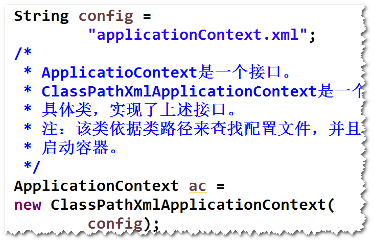

#### 3)创建对象
	方式一  无参构造器
		step1. 为类添加无参构造器（或者缺省构造器）。	
		step2. 在配置文件当中，添加bean元素。

		step3. 启动容器，调用容器提供的getBean方法。
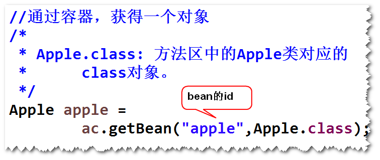

	方式二  静态工厂方法 (了解)
	方式三  实例工厂方法（了解）

附:
	<bean 

	id = "apple"   id属性:bean的名称,要求唯一 .

	class = "first.Apple"  class属性: 要写类的完整的名称.(包名.类名)

	factory-bean="cal"   factory-bean属性:指定一个bean的id. 容器会调用该bean的实例方法来创建对象. 

	factory-method="getInstance"  factory-method属性:指定一个实例方法或静态方法.(实例工厂方法/静态工厂方法)

	init-method= "init" ;  初始化方法

	destroy-method="destroy" 销毁方法

	scope="prototype"  scope属性:指定作用域.  缺省值是singleton(单例),如果值是prototype,则会创建多个实例

	lazy-init = "true"  lazy-init属性:如果值为true,表示延迟加载.

	/>

	set方法注入 .
	<property   property 元素 :表示set方法注入

	name = "b"  name属性:指定调用哪一个方法,容器会将属性名的第一个字母大写,然后在前面添加set,这儿,会调用"setB"方法
	ref = "b1"  ref属性:指定被注入的bean的id.
	/>

	构造器方法注入:
	<constructor-arg   constructor-arg元素 :表示采用构造器注入.

	index = "0" 	index属性:构造器参数的下标(从0开始).
	ref = "foo"	
	/>

#### 4)生命周期
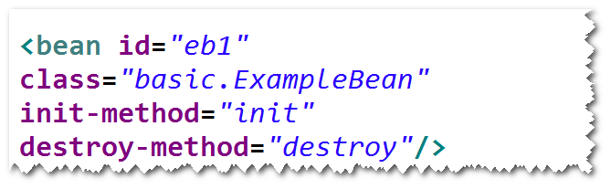

#### 5)作用域
	a.默认情况下，对于一个bean元素，容器只会创建一个实例。
	b.如果将作用域设置为"prototype"，则每调用一次getBean方法，
	都会创建一个新的实例。
	注：
		如果将作用域设置为"prototype"，则销毁方法不起作用。

#### 6)延迟加载(了解)
	a.默认情况下，容器启动之后，会将所用作用域为"singleton"的bean
	先实例化。
	b.容器启动之后，对于作用域为"singleton"的bean不再实例化，
	直到调用了getBean方法才会创建。

			
### (3)IOC和DI
#### 1)什么是IOC? (Inversion Of Controll 控制反转)
	对象之间的依赖关系由容器来建立。		
#### 2)什么是DI? (Dependency Injection 依赖注入)	
	容器调用set方法或者构造器来建立对象之间的依赖关系。
	注：
		IOC是目标，DI是手段。
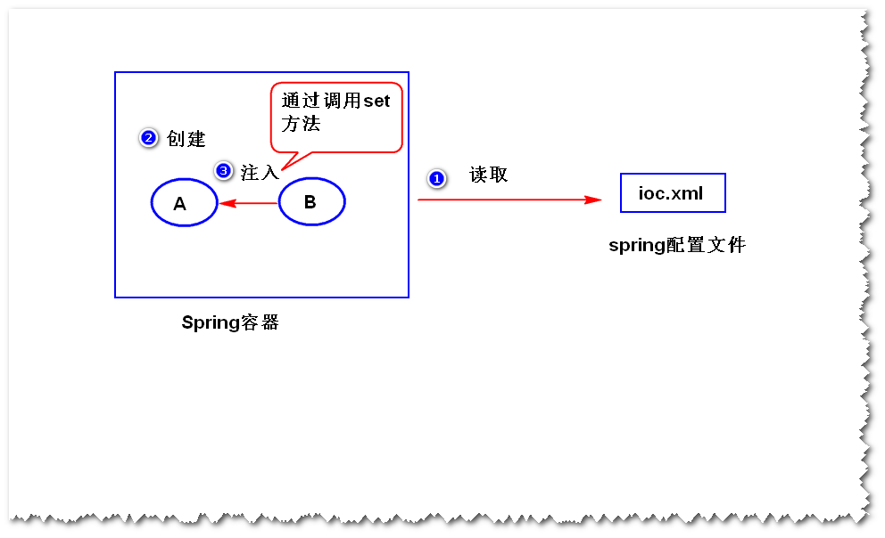

#### 3）set方法注入
	step1.添加相应的set方法。
	step2.在配置文件当中，使用<property>元素进行配置。
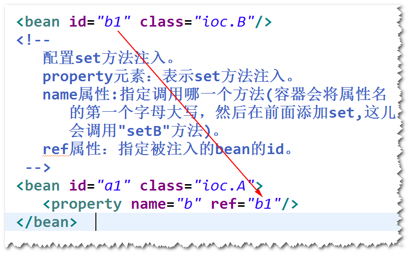

#### 4) 构造器注入
	step1. 添加相应的构造器。
	step2.在配置文件当中，使用<constructor-arg>元素进行配置。
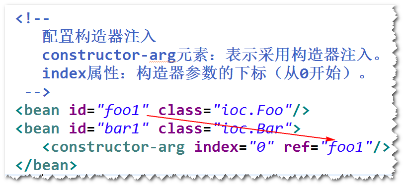			
		
		
	
# Spring-day02
			
#### 5)自动装配 (了解)
	a.什么是自动装配
	 容器依据某种规则，自动建立对象之间的依赖关系。
	 注：
		容器仍然需要调用set方法或者构造器。
		容器默认不会自动装配。
	b.如何自动装配
		可以设置autowire属性值：
		byName
		byType
		constructor

#### 6)注入基本类型的值
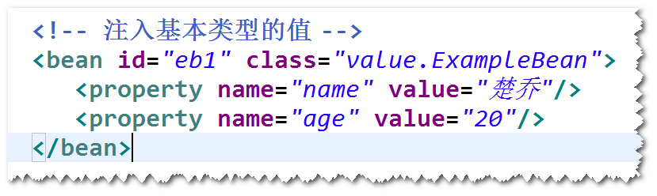

#### 7)注入集合类型的值
	List Set Map Properties
	方式一 使用list,set,map和props注入。
	方式二 以引用的方式来注入。
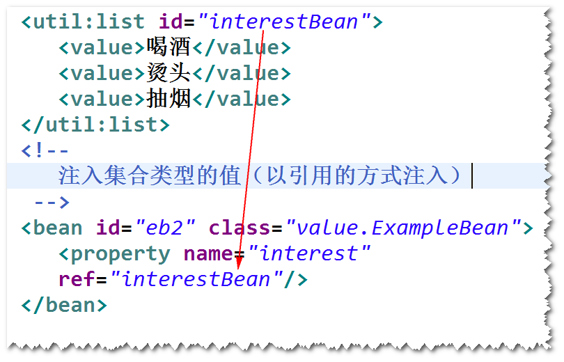

#### 8)spring表达式
	a.作用：用于访问其它bean的属性。
	b.用法:
	

练习：
	配置一个连接池并测试。

提示：
	step1. 导包  ojdbc,dbcp

	step2. 添加config.properties文件	添加到resource文件夹。

	step3. 在spring配置文件中，添加相关配置
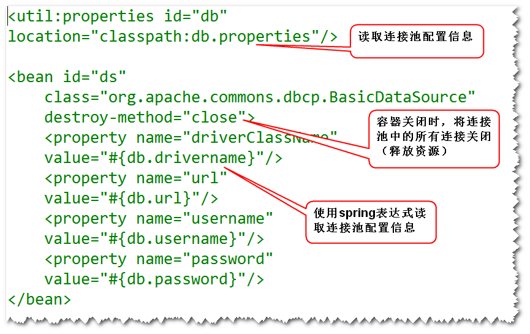

	step4.测试连接池
	

## 2. 使用注解来解化配置文件
### (1)什么是组件扫描？
		容器启动之后，会扫描指定的包及其子包下面的所有的类，
	如果该类前面有一些特定的注解（比如@Component）,则容器会
	将该类纳入容器进行管理（相当于在配置文件里面有一个bean）。
		注意：该bean默认的id是首字母小写之后的类名。
### (2)编程步骤
	step1. 在类前面添加一些特定的注解，比如 @Component。

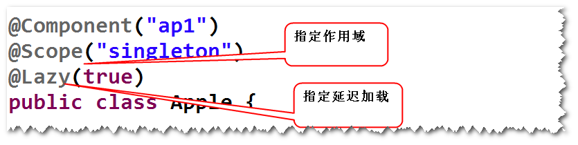

	step2. 在配置文件当中，配置组件扫描。	
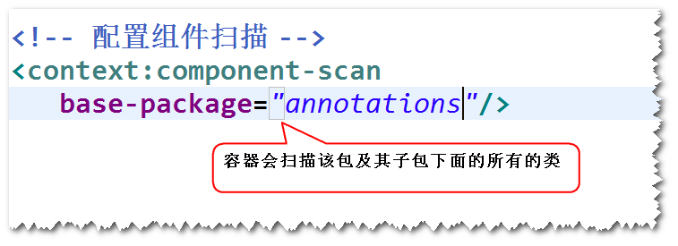

### (3)依赖注入相关的几个注解
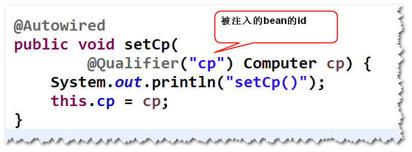
		
	

# Spring-day03

### (3)依赖注入相关的几个注解

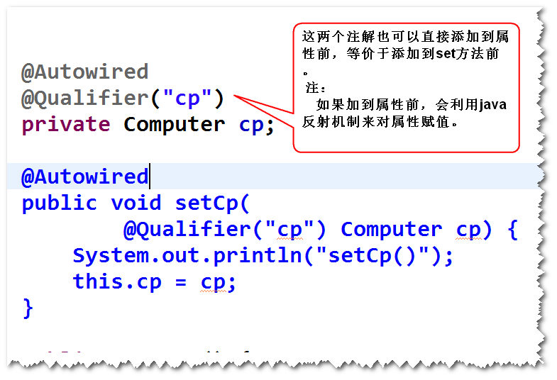
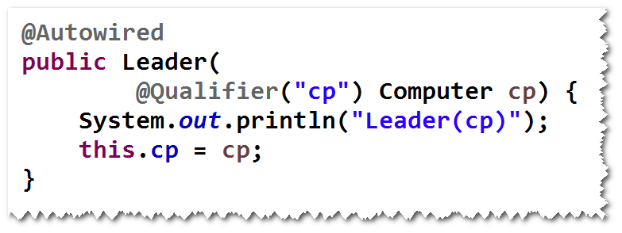
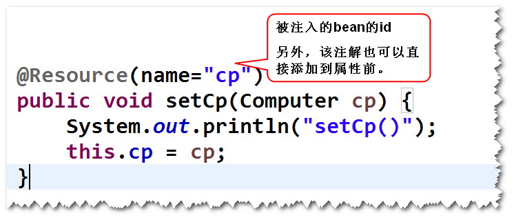
### (4)Value注解

## 1. MVC (Model View Controller 模型 视图 控制器)
### (1)什么是MVC?
	是一种软件架构模式，核心思想是将一个软件划分成
	模型、视图和控制器三种不同类型的模块，其中，模型负责
	封装业务逻辑的处理，视图负责提供界面（包括数据展现和
	用户操作界面），控制器负责协调模型和视图（视图将请求先
	发送给控制器，由控制器选择对应的模型来处理；模型将处理
	结果交给控制器，由控制器选择对应的视图来展现数据）。
### (2)如何使用MVC?
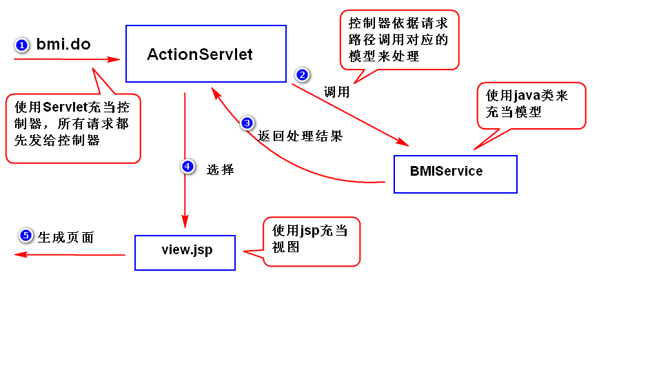
### (3)MVC的优点
	1)方便测试
		比如，直接将业务逻辑写在servlet里面，需要部署才能测试，
		而写在java类里面，可以直接测试（不用部署）。
	2)方便维护
		修改视图不影响模型，反过来，修改模型也不影响视图。
	3)方便分工协作 
		
## 2. SpringMVC

### (1)SpringMVC是什么?
	用来简化基于MVC架构的web应用程序开发的框架。
	注：SpringMVC是Spring框架的一部分。
### (2)五大组件
	1)DispatcherServlet  前端控制器
	2)HandlerMapping  映射处理器
	3)Controller  处理器
	4)ModelAndView  用于封装处理结果
	5)ViewResolver 视图解析器

### (5)编程步骤
	step1.导包
		spring-webmvc
	step2.添加spring配置文件
	step3.配置DispatcherServlet
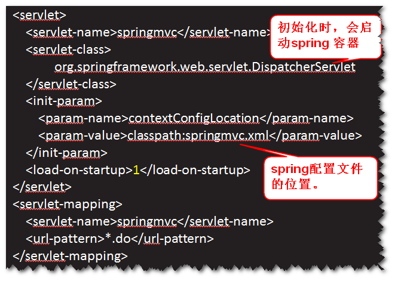

	step4.Controller类
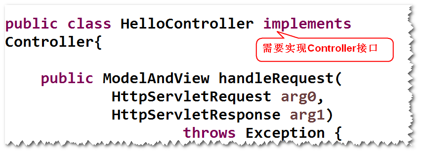

	step5.jsp
	step6.配置HandlerMapping和ViewResolver

### (6)helloworld案例的运行过程分析

练习：
	http://ip:port/spring-day03-3/toBmi.do
	返回计算bmi指数页面。

练习：
	修改员工管理模块，将所有jsp文件转移到/WEB-INF/下。

# Spring-day04

				
## 1. 基于注解的springmvc应用
	step1.导包。
		spring-webmvc
	step2.添加配置文件
	step3.配置DispatcherServlet
	step4.Controller类

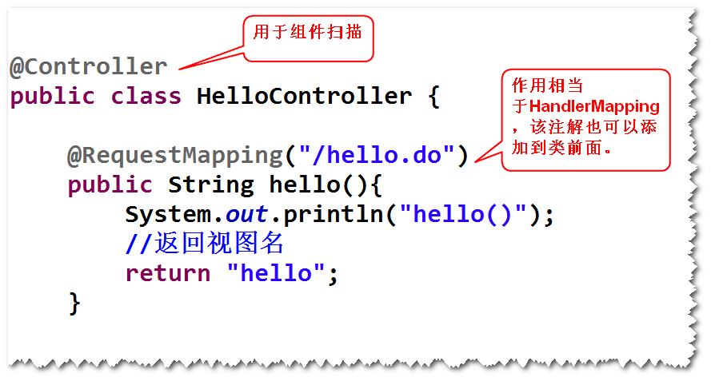

	step5.jsp
	step6.配置文件当中，添加
			组件扫描，mvc注解扫描，视图解析器。
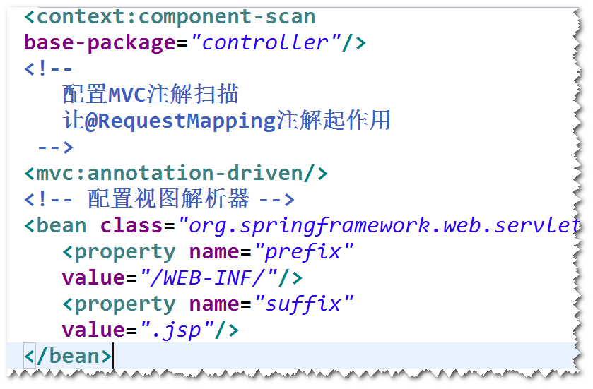

## 2. 读取请求参数值
### (1)通过request对象
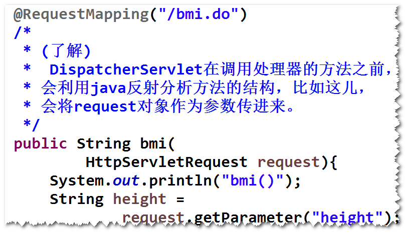	

### (2)通过@RequestParam注解
	

### (3)通过javabean
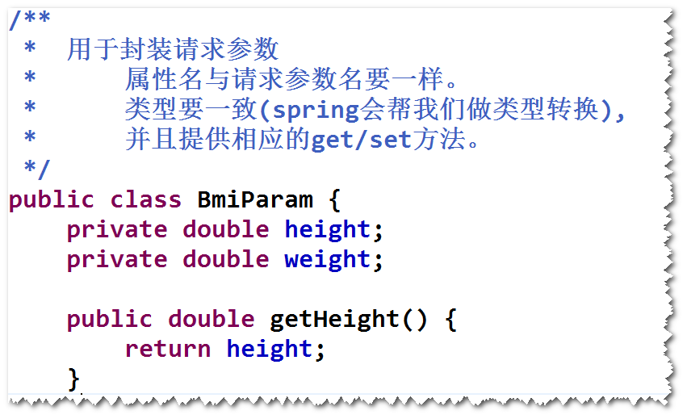	
		

## 3.向页面传值
### (1)绑订数据到request对象
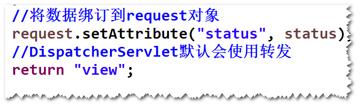	

### (2)返回ModelAndView对象

### (3)将数据添加到ModelMap对象

### (4)将数据绑订到session对象
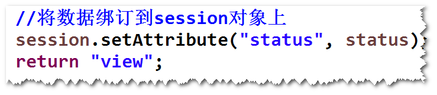

## 3.重定向
###　(1)如果方法的返回值是String
	return "redirect:toIndex.do"

###  (2)如果方法的返回值是ModelAndView
	RedirectView rv = 
		new RedirectView("toIndex.do");
	ModelAndView mav = 
		new ModelAndView(rv);

## 4. 系统分层（扩展）
### (1)如何分层?
	表示层 (UI层): 数据展现和操作界面，另外还要负责请求分发。 
	业务层（服务层）: 封装业务处理逻辑
	持久层（数据访问层）:　封装数据访问逻辑
	注意:
		a.上一层调用接口调用下一层的服务（比如，业务层要调用接口
	调用持久层）	，这样做的好处是，当下一层的实现发生改变，不影响
	上一层。
		b.表示层调用业务层，业务层调用持久层。
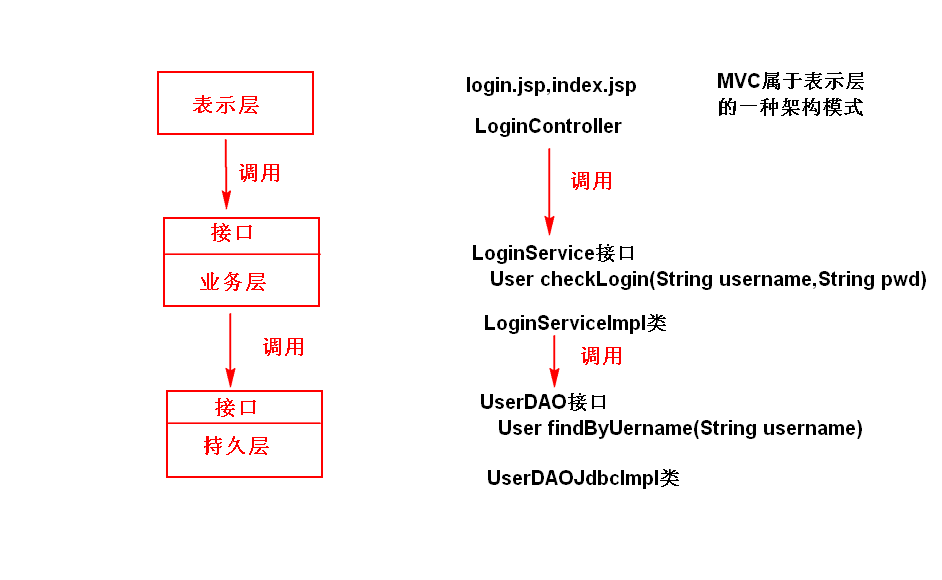

# Spring-day05

##   登录案例(按照系统分层思想来写)
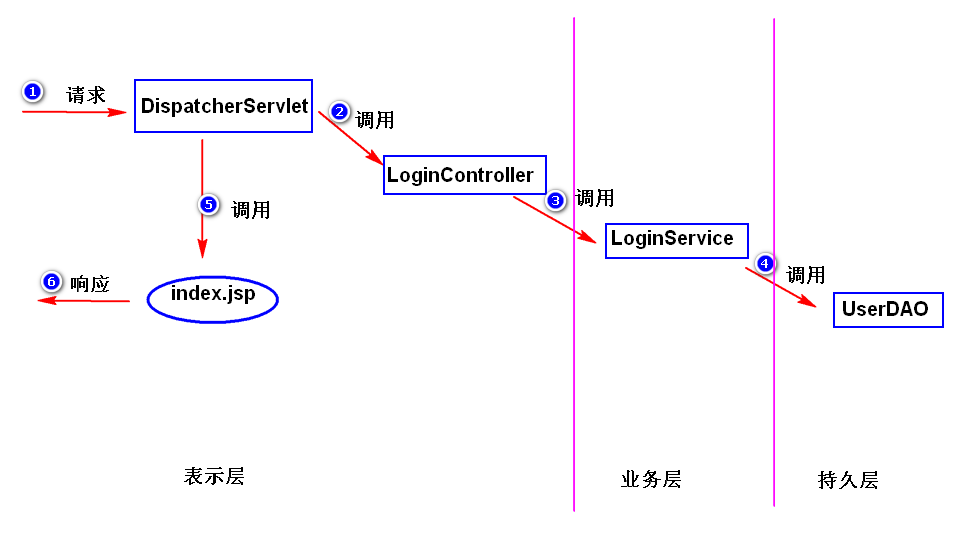

##	1.处理表单中文参数值乱码问题
	解决方式：
	配置SpringMVC提供的过滤器(CharacterEncodingFilter)。
	注意:
		a.表单提交方式必须设置为"POST"。
		b.过滤器所使用的编码与客户端的要一致。

##	2.拦截器
### (1)什么是拦截器?
	DispatcherServlet在收到请求之后，如果有拦截器，会先调用
	拦截器，再调用处理器(Controller)。
	注：
		过滤器属于Servlet规范，而拦截器属于Spring框架。
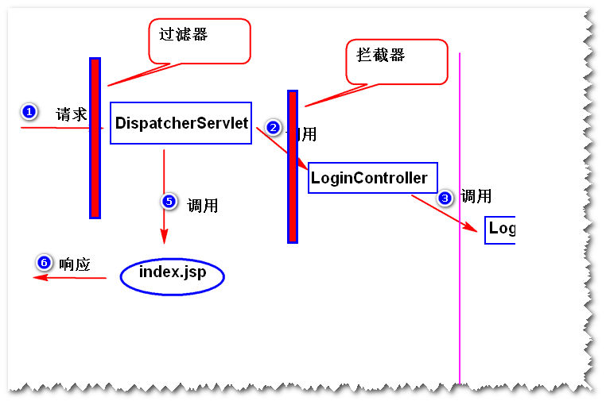

### (2)如何写拦截器?
	step1. 写一个java类，实现HandlerInterceptor接口。
	step2. 在拦截器接口方法当中，实现拦截处理逻辑。

	step3. 配置拦截器。　

# Spring-day06

## 1. 异常处理
### (1)方式一　配置简单异常处理器
	step1. 在配置文件当中，配置SimpleMappingExceptionResolver

	
	step2. 添加相应的异常处理页面。
	注：
		简单异常处理器只适合对异常进行一些简单的处理，如果要对
		异常做比较复杂的处理（比如记录日志），则需要使用方式二。
### (2)方式二　@ExceptionHandler
	step1.　在处理器类里面，添加一个异常处理方法。

	
	step2. 添加相应的异常处理页面。

## 2. SpringJdbc
### (1)SpringJdbc是什么?
	Spring对jdbc的简单封装。
### (2)编程步骤
	step1. 导包
		spring-webmvc,spring-jdbc,ojdbc,dbcp,junit
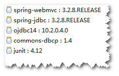

	step2. 添加spring配置文件
	step3. 配置JdbcTemplate　
　
	step4. 调用JdbcTemplate提供的方法来访问数据库
		注：
			通常将JdbcTemplate注入到DAO。
		

		

