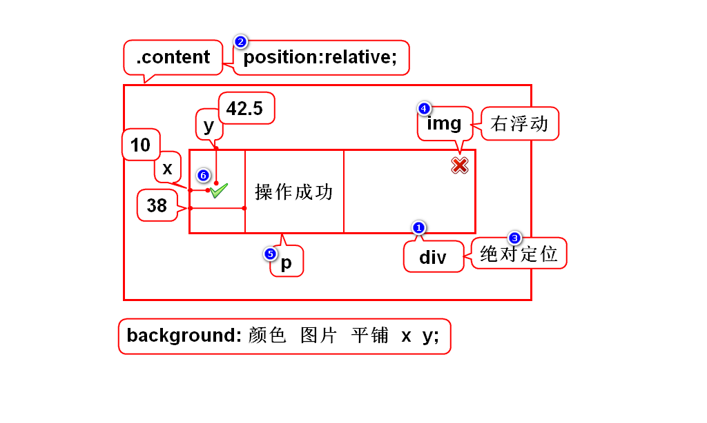
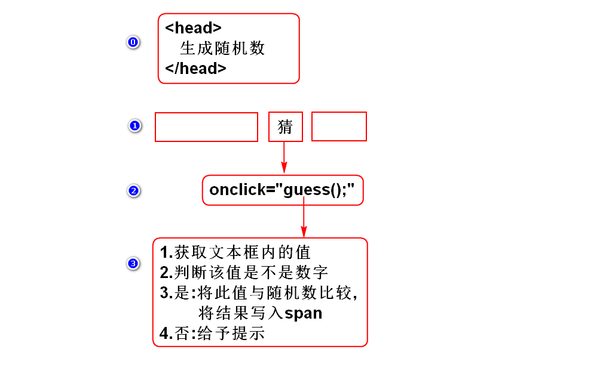

# Web-day01 #

## 一.Java知识体系

## 二.课程介绍
### 1.HTML(1.5天)
- 勾勒出网页的结构和内容

### 2.CSS(3天)
- 美化网页

### 3.JavaScript(4天)
- 可以让网页呈现动态的数据和效果

### 4.jQuery(1.5天)
- 是一个框架,可以极大的提高JS的编程效率

## 三.WEB概述

## 四.XML和HTML
### 1.XML
- 可扩展(自定义)标记语言
- 标签、属性、嵌套关系均可扩展
- 用来存储或传输数据

### 2.HTML
- 超文本标记语言
- 标签、属性、嵌套关系均固定(W3C)
- 用来显示数据
- HTML有些版本完全用XML规范定义的
> 可以将HTML理解为标签固定的XML

## 补充1:创建WEB项目的注意事项
### 1.选择JavaEE视图
- 在Eclipse右上角选择JavaEE

### 2.解决报错
- 展开项目
- 右键Deployment
- 点击Generate

## 五. 标签 ##

### 1. < !DOCTYPE html> 
### 2. < html>< /html> 唯一的根元素
- 内部有两个子元素< head>< /head> 和 < body>< /body>
#### 2.1< head>< /head>  对网页做出基本的声明
- 内部有两个子元素 < meta>< /meta> 和 < title>< /title>
#### 2.1.1< meta>< /meta> 声明网页的编码 ####
	< meta> charset="utf-8"< meta>
#### 2.1.2< title>< /title> 声明网页的标题
	<title>第一个网页</title>
#### 2.2< body>< /body>  用来书写网页的内容 ####
	<body>
		HTML真棒
	</body>
### 3.< h1>< /h1> 标题  ###
### 4.< p>< /p> 段落 ###

### 5.列表
#### 5.1< ol>< /ol> 有序列表
#### 5.2< ul>< /ul> 无序列表 ###
#### 5.3< li>< /li>定义列表项目 ###
#### 5.4列表嵌套 ###
	
	<!-- 嵌套列表 -->
		<ol>
			<li>
				河北省
				<ul>
					<li>石家庄</li>
					<li>保定</li>
				</ul>			
			</li>
			<li>
				山西省
				<ul>
					<li>太原</li>
					<li>大同</li>
				</ul>
			</li>
		</ol>

### 6.行内元素 ###
#### 6.1< span>< /span> 为部分文本设置样式属性###
	中鼎大厦
#### 6.2< b>< /b> 加粗
#### 6.3< i>< /i> 斜体 
#### 6.4< del>< /del>删除线 
#### 6.5< u>< /u> 下划线 
#### 6.6< em>< /em> 着重文字
#### 6.7< strong>< /strong> 加重文字
#### 6.8< br>  换行
#### 6.9实体引用

### 7.< img src = " "/> 图片 

- 1)绝对路径:从盘符开始写出图片的完整路径.这样的方式将路径写死了,一旦软件上线时,路径有变化,代码改动巨大. 
- 2)相对路径:只需要写出图片和网页的相对关系.

			<!-- 图片和网页平级 -->
			
			<!-- 图片在网页下级 -->
			
			<!-- 图片在网页上级 -->
			
			<!-- 一般这样用 -->
			
### 8.超链接 ###
#### 8.1 < a href=" ">< /a> ####
		<a href="http://www.tmooc.cn">达内</a>

		<!-- 从新页打开 -->
		<a href="http://doc.tedu.cn" target="_blank">文档</a>
#### 8.2 < a name=" ">< /a> 设置为锚点####
		<a name="cang">< /a>

#### 8.3 < a href = "# ">< /a> 设置锚点超链接

		<a href = "#cang">刘苍松</a>

#### 8.4< a href = "#">< /a> 链接到顶部####

### 9.表格 ###

- 跨行与跨列

#### 9.1< table> < /table> 表格标签 ####

	<table border="1" cellspacing = "0" width = "20%">
	1:表格线宽, 2:单元格与单元格的间距 3:表格的宽度
-  border:
-  width/height
-  align:
-  cellpadding 单元格边框与内容之间的间距
-  cellspacing 单元格之间的间距
-  border-collapse:separate/collapse:合并相邻的边框

#### 9.2< tr>< /tr> 行标签####

		跨列
		<td colspan = "2">苍老师</td>

- align/valign/colspan 水平对齐/垂直对齐

#### 9.3< td>< /td> 列标签(单元格)####

- align/valign/width/height/rowspan

		跨行
		<td rowspan = "2">苍老师</td>

			<tr>
				<td>苍老师</td>
				<td>范传奇</td>
			</tr>
			<tr>
				<td>王克晶</td>
				<td>程祖红</td>
			</tr>
### 10.行分组 ###

#### 10.1< thread>< /thread> 表头行分组

#### 10.2< tbody>< /tbody> 表体行分组
	
	设置表体线的颜色
	<tbody style="color:blue"></tbody>

#### 10.3< tfoot>< /tfoot> 表尾行分组

## 11.英雄联盟案例
### 11.1 先分区(3)
- 每个区域都需要加边框,设置宽度,居中
- style="border:1px solid red;width:960px;margin:0 auto;"

### 11.2 逐个区域开发

# Web-day02
## 1.表单  ##
- 表单用来输入数据,用来发送数据的元素 
###1) < form>< /form> 表单元素  ###

- 用来声明表单的范围,只有在此范围内的控件中的数据才能发送给服务器.
- 属性:
	- action:声明表单提交的目标
	- method:
	- enctype: 

		< form action = "http://doc.tedu.cn">< /form>
### 2)表单控件 ##
- 用来输入数据

####2.1)input 元素(9个)  ####

		单标签:
		< input type="text" value="rarena" maxlength="10" readonly/>

- 1.type="text" 文本框
	- value:设置默认值
	- maxlength:设置最大长度
	- readonly:设置只读

			账号:< input type="text" value="rarena" maxlength="10" readonly/>

- 2.type="password"密码框
	- value:设置默认值
	- maxlength:设置最大长度
	- readonly:设置只读
			
			密码:< input type="password"/>

- 3.type = "radio" 单选框
	-  同一组radio彼此互斥.:用name=""来分组
	-  checked:默认选中
	-  value:将来讲
	
			性别:
			< input type="radio" name="sex" checked/>男
			< input type="radio" name="sex"/>女	

- 4.type="checkbox" 多选框
	-  checked: 默认选中
	-  name:
	-  value: 

			兴趣:
				< input type="checkbox" checked/>美食
				< input type="checkbox" checked/>竞技
				< input type="checkbox"/>社交
				< input type="checkbox"/>旅游 
- 5.type = "hidden" 隐藏框
	- value: 默认值
	 		
			< input type = "hidden" value="love"/>
- 6.type ="file" 文件框

			头像:
			< input type ="file"/>

- 7.type = "submit" 提交按钮
 
			< input type = "submit" value = "注册"/>

- 8.type = "reset" 重置按钮

			< input type = "reset" value = "重置"/>

- 9.type = "button" 普通按钮
		
			< input type = "button" value = "测试"/>

#### 2.2) 其他元素(3个) ####

- 1.< label>< /label>   
	- label 用来管理表单中的文本,可以将文本与控件绑定到一起,从而增加了控件的可点击范围,提高了易用性

			< input type = "checkbox" id="c1"/>
			< label for="c1">我已阅读并自愿遵守此协议!< /label> 

- 2.< select>< option>< /option>< /select> 下拉菜单 
	- selected: 默认选中
	- value:

			城市:
			<select>
				<option>请选择</option>
				<option>北京</option>
				<option selected>上海</option>
				<option>广州</option>
				<option>深圳</option>
			</select>

- 3.< textarea>< /textarea>  文本域
	- cols:宽度
	- rows:高度
	- readonly:只读 
	
	
			简介:
				< textarea cols="30" rows="8" readonly>嘿嘿< /textarea>

## 2. CSS 层叠样式表  ###

### 1) 内联样式: 样式定义在单个元素的style属性中直接书写的样式

		<h1 style = "color:red;">CSS</h1>

### 2) 内部样式:样式定义在html页头元素style标签内书写的样式 ###

		在<head>标签中:

		

### 3) 外部样式:在外部单独的CSS文件中(.css文件)书写样式 ###

		首先在<head>标签内引用样式表文件:
		<link rel="stylesheet" href="my.css"/>

		my.css文件中:
			p{
				color:yellow;
			}
### 4)层叠样式三种规则特性: ###

- 1.继承性:父元素 上面的样式可以被子元素继承(颜色,字体,字号)
- 2.层叠性:给一个元素增加不同的声明,其效果会产生叠加.
- 3.优先级:给一个元素增加相同的声明,其效果以后者为准,也叫就近原则
### 5)CSS语法规范: ###

- 每个样式规则有两个部分:选择器和样式声明

## 3.CSS选择器 ##

### 1)元素选择器 ###

- 通过元素名来选择CSS作用的目标 
- 如:< h> < h1> < body>
- 如果页面中有多个相同的元素需要重用同样的效果,建议使用元素选择器

### 2).className {} 类选择器:选择class=某值的所有元素,用来选择一类元素 ###
	
	CSS 代码
	.female {
		color:pink;
	}

	HTML代码:
	
绿树浓荫夏日长< /p>

### 3)#idName {} id选择器:选择id=某值的唯一元素 ###

	
		CSS 代码:
		#p4{
			color:red;
		}

		HTML代码:
		
绿树浓荫夏日长

### 4)选择器组:写出一组选择器,逗号隔开,可以选中每个选择器所对应的目标的并集  ###

		CSS代码:
		.female,#p4 {
	
			font-weight:bold;
		}

### 5)派生选择器:用来选择子元素 ###
#### 5.1)后代选择器: 选择某元素的所有后代(子孙)元素####

	CSS代码:
	#p5 b{
		color:red;	
		font-size:5px
	}
	HTML代码:    <!-- 目标为"北三环"三个字 -->
	
北京市<u>海淀区<b>北三环</b>西路</u>甲18号<b>中鼎大厦</b>B座8层

#### 5.2)子元素选择器:选择某元素的所有子元素(儿子) ####

	CSS代码:
	#p5>b {
		font-size:30px	
	}
	
	HTML代码:    <!-- 目标为"中鼎大厦"四个字 -->
	
北京市<u>海淀区<b>北三环</b>西路</u>甲18号<b>中鼎大厦</b>B座8层

### 6)伪类选择器:根据元素状态选择元素 ###

#### 6.1) 选择访问过/未访问过的超链接 ####

- 未被访问过的
		a:link {   
			color:green;
		}

- 访问过的
	
		a:visited {   /*访问过的*/
			color:red
		}

#### 6.2)选择激活态(正在点)的按钮 ####

		\#btn1:active{
			background-color:yellow;
		}

#### 6.3)选择有焦点(光标)的框/ ####

		#t1:focus {
			background-color:pink;
		}
	
#### 6.4)选择悬停态(鼠标位于正上方)的元素 ####

		img:hover{
			width:250px;
			height:250px;
		}

## 4.border与box ##

### 4.1)border属性:用来设置元素边框 ###
- 默认情况下,元素的高度会自适应,有多少行字它就有多高,不会溢出.当给元素固定了高度后就可能导致内容的溢出. 

- 四边设置语法:
	

	- border:width值 style值 color值;
- 单边设置语法:
	- border-left:width值 style值 color值;
	- border-right:width值 style值 color值;
	- border-top:width值 style值 color值;
	- border-bottom:width值 style值 color值;

- width单位:
	- %:百分比
	- px:像素
	- em(1em等于当前文字的尺寸,2em等于当前文字尺寸的两倍)
- color单位:
	- #rrggbb:十六进制
	- #rgb:十六进制简写
	- rgb(x,x,x):RGB值
	- rgb(x%,x%,x%):RGB百分比值
	- red:英文单词

			/* 单边设置 */
			h1{
				border-left: 15px solid blue;
			}
	
			/* 四个边增加边框 */
			p{
				border: 1px dashed red;
			}

			/*默认情况下,元素的高度会自适应,有多少行字它就有多高,不会溢出.当给元素固定了高度后就可能导致内容的溢出. */
			p{
				width: 200px;
				height:50px;	
				overflow:auto
			}

- overflow:当内容溢出元素框时如何处理
	- isible
	- hidden
	- scroll
	- auto

### 4.2)box 框模型 :定义了元素框处理元素内容,内边距,边框,和外边距的方式###

- 属性:
	- background-color:背景颜色
	- background-image:背景图片

		body{
			background-image:url('../images/01.png');
		}

	- background-repeat:控制背景图片的平铺效果,可取值为
		

		- repeat:垂直方向和水平方向重复
		- repeat-x:仅在水平方向重复
		- repeat-y:仅在垂直方向重复
		- no-repeat:仅显示一次
		
#### 4.2.1)单边设置:给四个边设置不同的边距
- 方式一:

		#d2{
			/*顺序 : 上 右 下 左 */
			padding:10px 20px 30px 40px;
			margin:40px 30px 20px 10px;
		}

- 方式二:

		#d3{
			padding-top:20px;
			padding-right:40px;
			padding-bottom:20px;
			padding-left:40px;
			margin-top:20px;
			margin-right:40px;
			margin-bottom:20px;
			margin-left:40px;
		}

#### 4.2.2) 四边设置相同的边距 ####

		#d1 {
			padding:20px;
			margin:40px;
		}

#### 4.2.3)对称设置边距
- 2个参数,第一个参数为上和下,第二个参数为 左和右

		#d5{
			padding:20px 40px;
			margin:30px 50px;
		}

#### 4.2.4)单边设置边距 ####

 	#d3{
	 	padding-left:20px;
	 	margin-bottom:30px;
		}	
#### 4.2.5)对称设置外边距的特例:当左右为auto时,元素会水平居中 ####
		 #d5{
		  	margin:20px auto;
		  }

## 5. 背景 ##
### 5.1 background-color 背景色 ###
### 5.2 background-image 背景图片 ###
- background-repeat:属性,可以控制背景图片的平铺效果
> repeat:在垂直和水平方向重复
 
> repeat-x:仅在水平方向重复
 
> repeat-y:仅在垂直方向重复
 
> no-repeat:仅显示一次

- background-position: 属性用于改变背景图片在元素中的位置
>x% y%:第一个值为水平位置,第二个值为垂直位置

>x y:第一个值为水平位置,第二个值为垂直位置

>left:  左边显示

>center:中心显示

>right:右边显示

>top:顶部显示

>bottom:底部显示

- background-attachment:属性来改变此特征
>scroll:默认情况下背景会随文档滚动

>fixed:背景图像固定,并不会随着页面的其余部分滚动,常用于实现水印图像

# web-day03 #

## 1.选择器的优先级
### 1.1 选择器的优先级看权重(分值)
- 元素选择器: 1
- 类选择器: 10
- ID选择器: 100
> 权重越大优先级越高

### 1.2 举例
- .data: 10
- .content>div: 10+1
- .content>.data: 10+10
> 增加父亲不会影响逻辑,但是会提高选择器的优先级

## 2.W3C中文手册
- 外网: www.w3school.com.cn
- 内网: doc.tedu.cn

## 3.文本格式化 #

- font-family:value1,value2; 指定字体
- font-size:value;  指定字体大小
- font-weight:normal/bold; 字体加粗
- color:value; 文本颜色
- text-align:left/right/center;文本排列
- text-decoration:none/underline; 下划线
- line-height: value(1.6em); 行高
- text-indent:value(2em);首行文本缩进

## 4.表格样式 #

- 表格同样可以使用box模型(边框,内边距,宽,高)以及文本格式化属性
- border-collapse属性:表格特有的样式属性:设置是否将表格相邻边框合并为单一边框
	- separate:不合并
	- collapse:合并

# Web-day04 #
## 1.定位
### 1.1 什么是定位
- 用来解决元素的排列(摆放)问题
> 采用定位可以将元素摆放到网页的任意的位置

### 1.2 定位的分类

- 流定位:默认定位
	- 默认情况下,块元素垂直排列,行内元素水平排列
	- 这种默认排列的方式叫默认定位,也叫流定位
	> 流:元素有序排列而形成的队伍
- 特殊定位:
	- 浮动定位:可以让块元素水平排列

	- 相对定位:让元素以自身为目标产生微小的偏移

	- 绝对定位:让元素以父辈为目标产生较大的偏移

	- 固定定位:让元素以窗口为目标产生巨大的偏移
> 后三种定位十分相似

### 1.3 浮动定位
- 浮动定位是指:1.让元素脱离普通流定位,2.将浮动元素放置在父元素的左边或者右边,3.浮动元素依旧位于父元素之内
- 作用:可以让块左右排列
- 分类:左/右浮动
- 步骤:1)目标离队 2)后者跟进 3)目标到达指定位置

#### 1.3.1 左浮动
- 可以让块按照正序左右排列

- float:none/left/right;属性用于定义元素在哪个方向浮动
- clear:none/left/right/both;用于清除浮动所带来的影响
	- 对哪个元素clear,该元素将不受浮动影响,出现在浮动目标之下

#### 1.3.2 右浮动
- 作用:可以让块按照倒序左右排列

#### 1.3.3 照片墙

## 1.4 相对、绝对、固定定位
### 1.4.1 它们的相同点
- 设置偏移量的方式相同

#### 1.4.2.它们的区别
- 它们偏移时参考的目标不同

#### 1.4.3 相对定位
- 以自己为目标,产生小的偏移
- 元素的位置不释放(不脱离流)
- 设置元素为相对定位:首先需要设置position属性的值为relative,然后使用left,right,top,bottom设置偏移量
- position: relative;
	- left:设置偏移量
	- right:设置偏移量
	- top:设置偏移量
	- bottom:设置偏移量
	 
> 元素的位置不释放

#### 1.4.4 绝对定位
- 以带有position属性的父辈为目标
- 若父辈都有position则以就近的父辈为目标
- 若父辈都没position则以body为目标
- 元素的位置释放(脱离流)
- position: absolute;
	- left:设置偏移量
	- right:设置偏移量
	- top:设置偏移量
	- bottom:设置偏移量
> 想以谁为目标就在谁上面加position

#### 1.4.5 固定定位
- 以浏览器的窗口为目标
- 元素的位置释放(脱离流)
- position: fixed;
	- left:设置偏移量
	- right:设置偏移量
	- top:设置偏移量
	- bottom:设置偏移量
> 元素会挂在窗口上保持不动

### 1.5 定位的应用
#### 1.5.1 选择定位的建议
- 固定定位: 看看是否要将元素挂在窗口之上
- 浮动定位: 看看是否要将块左右排列
- 相对定位: 看看是否元素的位置不释放,释放偏移量很小
- 绝对定位: 思考15秒之上一般就是绝对定位

### 1.6 堆叠顺序 ###
- 一旦修改了元素的定位方式,则元素可能会发生堆叠

- z-index 属性:可以控制元素出现的重叠顺序
	
	- 值为数值:数值越大表示堆叠顺序更高.
	
	- 可以设置为负值:表示离用户更远.

## 2. 管理员列表-5

## 3.列表样式

- list-style-image:属性使用图像来替换列表项的标记
	- 取值为:url(); 指定图像作为有序或无序列表项的标志
- list-style-type:属性用于控制列表中列表项标志的样式
- 无序列表取值:
	- none:无标记
	- disc:实心圆,为默认值
	- circle:空心圆
	- square:实心方块
- 有序列表取值:
	- none:无标记
	- decimal:数字(如1,2,3),为默认值
	- lower-roman:小写罗马数字
	- upper-roman:大写罗马数字
- 

## 4. 元素的显示方式
### 4.1 块
- 特点: 有宽高,上下排列
- h#,p,ol,ul,div,table,form

### 4.2 行内
- 特点: 无宽高,左右排列
- span,b,strong,i,em,u,del,a,lable

### 4.3 行内块
- 特点: 有宽高,左右排列
- img,input,select,textarea

### 4.4 如何修改元素的显示方式
- display: block;			块
- display: inline;			行内
- display: inline-block;		行内块
- display: none;				隐藏,并释放空间

## 5.管理员列表-6

## 6.鼠标形状 ##

- cursor:属性定义了鼠标指针放在一个元素边界范围内时所用的光标形状
	- default
	- pointer
	- crosshair
	- text
	- wait
	- help等

# Web-day05 #

## 1.什么是JavaScript ##
- 最早由网景公司在Netscape2.0首先推出了JavaScript,现在由ECMA组织维护. JavaScript是嵌入HTML中在浏览器中的脚本语言,具有和java和C语言类似的语法,用来向HTML页面添加交互行为
- 特点:
	- 可以使用任何文本编辑工具编写
	- 由浏览器内置的JavaScript引擎执行代码,事先不编译,逐行执行,内置大量现成对象
	
	
	- 适宜:客户端数据计算,客户端表单合法性验证, 浏览器事件的触发,网页特殊显示效果制作,服务器的异步数据提交
## 2.使用JavaScript ##
>事件:就是用户的操作/动作,就是js触发的时机.如:单击,双击事件.

- 2.1 事件定义式:在定义事件时直接书写js

	< input type="button" value="按钮1" onclick="alert('苍老师');"/>
- 2.2 嵌入式:在script标签内书写js.该标签可以写在网页的任意位置 

		< input type="button" value="按钮2" onclick="f2();"/>

		< script>
			//1.js中的函数都是公有的
			//2.js中的函数可以有返回值,但是不需要声明类型
			function f2(){
				//js中不区分单引号和双引号
				alert("范传奇")				
			}
		< /script>
- 2.3 文件调用式:在单独的js文件中书写js.
	 
		- 该标签要么用来引入js,要么用来书写js.	 
		< script src = "my.js">< /script>
## 3.基本语法  ##

- 由Unicode字符集编写
- 注释
	- 单行://
	- 多行:/* */
- 语句
	- 表达式,关键字,运算符组成
	- 大小写敏感
	- 使用分号或者换行结束(建议加上分号),一行中有多个语句不能省略分号

## 4.标识符与关键字 ##
- 标识符:由不以数字开头的字母,数字,下划线,美元符号组成
- JavaScript语言中代表特定含义的词称为保留字,不允许程序再定义为标识符
	- class int float等

- 变量声明:使用关键字var声明变量
- 变量初始化:使用"="赋值 , 没有初始化的变量则自动取值为undefined

## 5.数据类型 ##
- 变量没有类型,统一用关键字var声明.变量所引用的数据是有类型的.
- 

- 数据类型的隐式转换:
	- 数字+字符串:数字转换为字符串
	- 数字+布尔值:true转换为1,false转换为0
	- 字符串+布尔值:布尔值转换为字符串true或false
	- 布尔值+布尔值:布尔值转换为数值1或0
- 数据类型转换函数:
	- toString():所有数据类型均可转换为String类型
	- parseInt():强转为整数,如果不能转换则返回(NaN)(not a number)
	- ParseFloat():强转为浮点数,如果不能转,也返回(NaN)
	- typeof():查询当前类型,返回string/number/boolean/object/function/undefined
	
	- isNaN():判断被检测表达式经过转换后是否不是一个数,不是返true,否则返回false 

## 6.运算符 ##
- 除(/),java中5/2=2.js中 5/2=5.2;
- + - * % ++ --和java相同
## 7.关系运算 ##
- 全等 :===
- 不全等:!==

		var c = 6;
		var d = "6";
		console.log(c==d);//true
		console.log(c===d);//false
- > < >= <= == != 同java
## 8.逻辑运算 ##
- 逻辑非! 逻辑与&& 逻辑|| 同java

## 9.条件运算 ##
- 又称三目,三元运算 同JAVA

## 10.分支结构 ##
- if,switch-case 同java

## 11.循环结构 ##
- for,while,do-while 同java

## 12.条件表达式 ##
- js中允许使用任何值做条件,当该值是非布尔值时,若它是空值,则相当于false,若它是非空值,则相当于true.

	//这样的规则是为了简化条件表达式.
	var k = "hi";
	if(k){
		console.log("ok");	
	}

	var h = 9;
	h && console.log("猥琐");  //短路

## 13.js调试技巧
### 13.1 看错误信息
- 看控制台的报错信息

### 13.2 打桩
- 跟踪程序执行的过程
- 看每一步的变量的值是否正确

### 13.3 排除法
- 用来定位错误的
- 建议采用二分法删除代码,以定位错误出现的位置

案例 一.计算平方

案例 二.猜数字

案例 三.计算阶乘

# Web-day06 #

## 一.内置对象
### 1.String对象
- 几乎和Java一样

### 2.Number对象
- toFixed(n) *

### 3.Array对象
- 创建数组
- 数组倒转方法
- 数组排序方法(*)

### 4.Math对象
- 几乎和Java一样

### 5.Date对象
- 如何创建日期对象
- 如何格式化日期对象
- 如何读写时间分量

### 6.RegExp对象
#### 1)正则对象的方法
- 如何创建正则对象
- test() *
- exec()

#### 2)字符串支持正则的方法
- replace()
- match()
- search()
> 看看W3C中文手册

### 7.Function对象
- arguments *
- eval *

## 二.外部对象
- 外部对象就是浏览器提供的API
- 外部对象包括BOM和DOM,二者是包含关系

# Web-day07 #
## 一.动态时钟

## 二.发送消息

## 三.DOM

# Web-day08 #
## 一.图片轮播

## 二.省市联动

## 三.加入购物车

## 四.加法

# Web-day09 #
## 一.自定义对象
### 1.分类
#### 1.1直接量(JSON)
- {"name":"zhangsan","age":26}
- {}代表一个对象,包含多组键值对
- key通常是字符串,value可以是任意类型的数据

#### 1.2构造器(首字母大写的函数)
##### 1)内置构造器
- 特殊含义: Array, Date, String, RegExp
- 通用: Object

##### 2)自定义构造器
- 定义一个首字母大写的函数
- 明确声明要传入哪些参数
- 在函数内写代码将传入的参数保存在此对象上

### 2.归纳
- 无论采用哪种方式创建的对象本质上都是Object
- 若创建的对象给别人调用,建议使用第3种方式

## 二.事件
### 1.事件概述
#### 1)什么是事件
- 是用户的操作/动作,是js被调用的时机

#### 2)事件分类
- 鼠标事件
- 键盘事件
- 状态事件: 当某条件达成时自动触发的事件

### 2.事件定义
#### 1)直接定义事件
- 直接在元素上通过事件属性定义事件
- 优点:直观
- 缺点:耦合度高

#### 2)动态绑定事件
- 在页面加载后,通过js获取元素并给它追加事件
- 优点:耦合度低
- 缺点:不直观

#### 3)如何取消事件
- return false

### 3.事件对象
#### 1)什么是事件对象
- 背景:在某些功能里,需要获得鼠标的坐标,键盘的按键等信息
- 事实上,在事件触发的那一刻,浏览器会自动创建一个对象event
- 浏览器会把和本次事件相关的所有信息存入此对象
- 这个封装事件信息的对象event叫做事件对象

#### 2)事件对象如何使用
- 直接定义事件时: 在调用函数时传入event
- 动态绑定事件时: 浏览器自动给函数传入event

### 4.事件机制
#### 1)冒泡机制
- 事件是由内向外传播的

#### 2)如何取消冒泡
- e.stopPropagation()
- e.cancelBubble = true

#### 3)冒泡机制的作用(*)
- 用来简化事件的定义

#### 4)需要解决的问题
- 获取事件源
- e.srcElement || e.target

### 5.计算器案例
